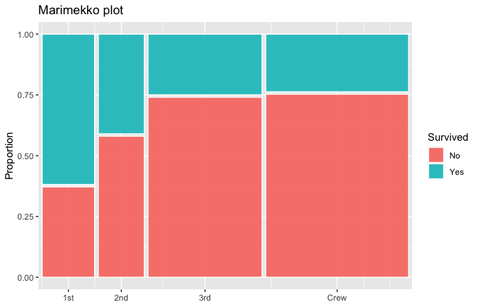
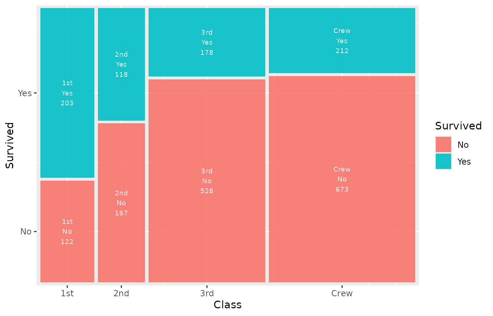
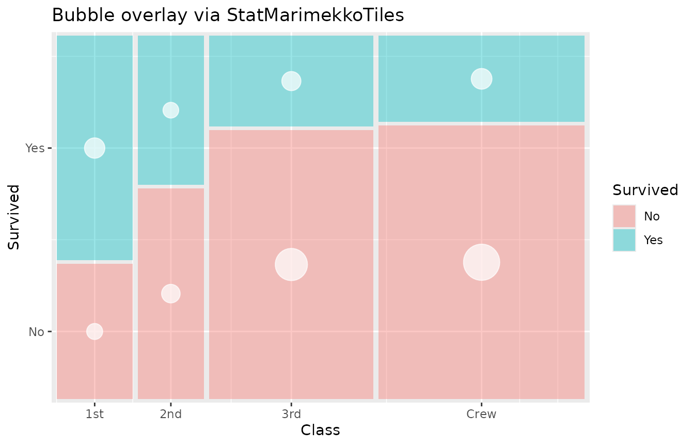
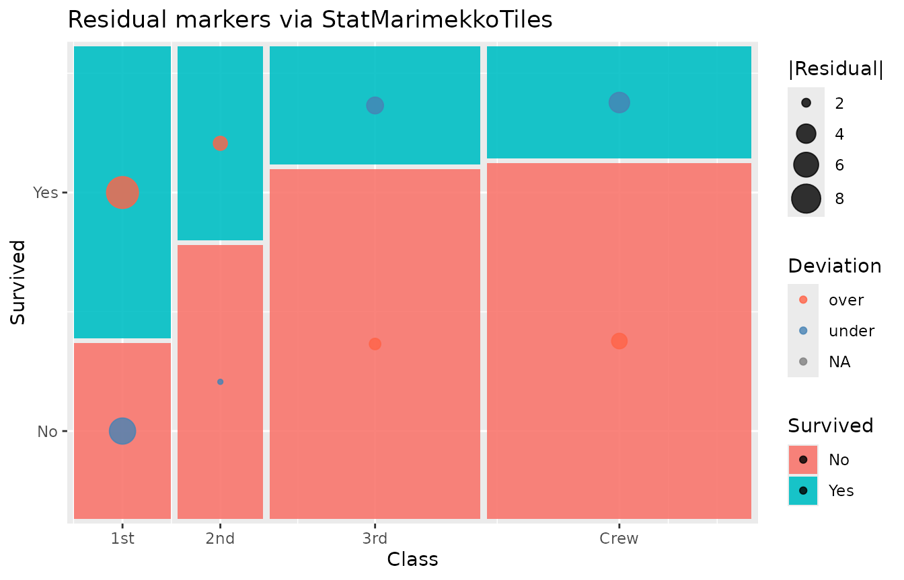
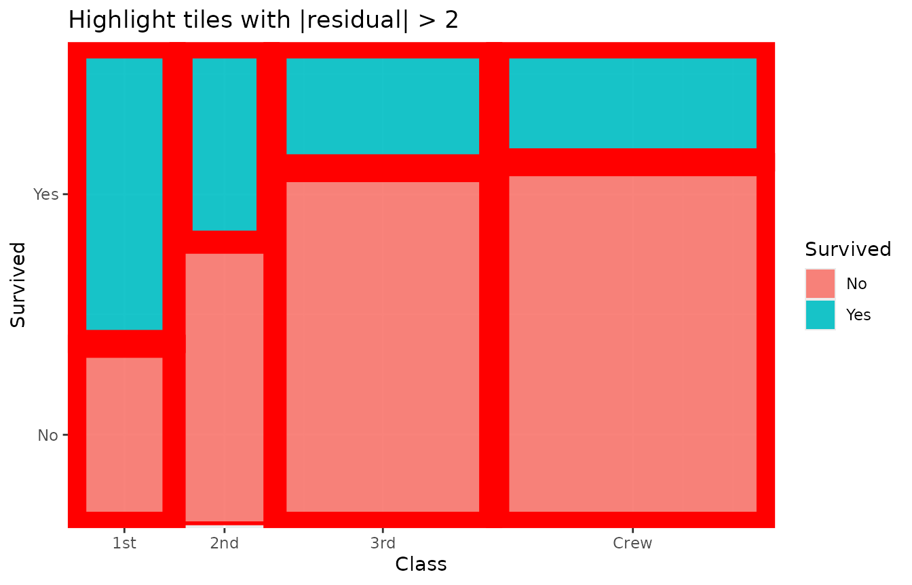
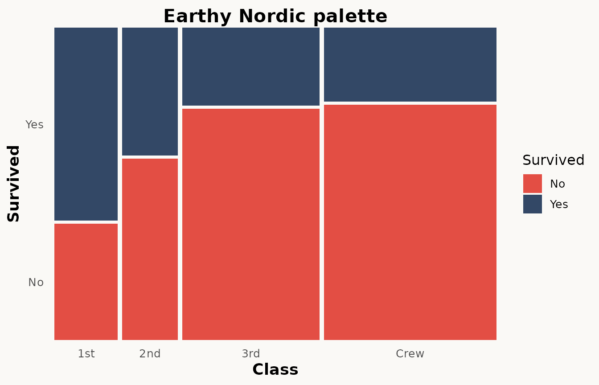
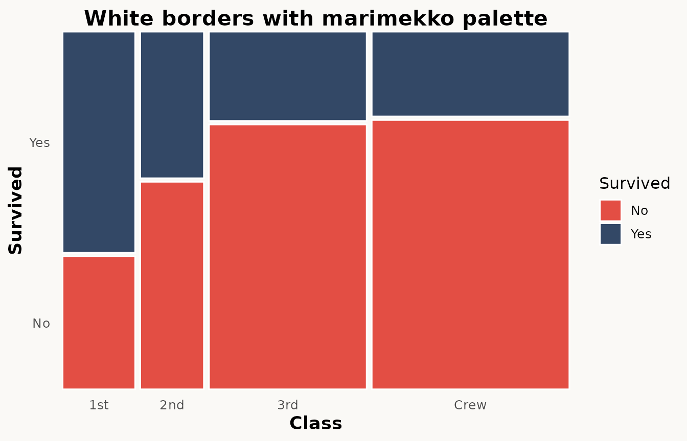

# Advanced features

``` r
library(ggplot2)
library(marimekko)

titanic <- as.data.frame(Titanic)
```

This vignette covers the advanced features of `marimekko` beyond the
basics shown in
[`vignette("getting-started")`](../articles/getting-started.md).

## Basic marimekko plot

``` r
ggplot(titanic) +
  geom_marimekko(aes(fill = Survived, weight = Freq), formula = ~ Class | Survived)
```



## Pearson residuals

Pearson residuals measure how much each cell deviates from the
independence assumption. Positive residuals indicate more observations
than expected; negative residuals indicate fewer.

Residuals are automatically computed and exposed as the `.residuals`
computed variable, which you can map to an aesthetic via
[`after_stat()`](https://ggplot2.tidyverse.org/reference/aes_eval.html):

``` r
ggplot(titanic) +
  geom_marimekko(
    aes(
      fill = Survived, weight = Freq,
      alpha = after_stat(abs(.residuals))
    ),
    formula = ~ Class | Survived
  ) +
  scale_alpha_continuous(range = c(0.3, 1), guide = "none") +
  labs(title = "Residual shading: stronger opacity = larger deviation")
```


You can also map residuals to colour instead of relying on fill:

``` r
ggplot(titanic) +
  geom_marimekko(aes(fill = Survived, weight = Freq),
    formula = ~ Class | Survived
  ) +
  geom_marimekko_text(aes(
    label = after_stat(round(.residuals, 1))
  ), colour = "white", size = 3) +
  labs(title = "Pearson residuals as labels")
```


## Three-variable nested mosaic

[`geom_marimekko()`](../reference/geom_marimekko.md) supports
multi-variable formulas. A three-variable formula (`~ X | Y | Z`)
partitions the plot in alternating directions (horizontal, vertical,
horizontal):

- First split: horizontal by `X` (column widths proportional to `X`)
- Second split: vertical by `Y` within each column
- Third split: horizontal by `Z` within each cell

``` r
ggplot(titanic) +
  geom_marimekko(aes(fill = Survived, weight = Freq),
    formula = ~ Class | Survived | Sex
  ) +
  labs(title = "Nested mosaic: Class > Sex > Survived")
```


This produces a richer view than faceting because all three variables
share a single coordinate space, making relative proportions directly
comparable.

## Y-axis labels

By default [`geom_marimekko()`](../reference/geom_marimekko.md)
automatically labels both axes with category names. The y-axis shows
proportions from 0 to 1, while the x-axis displays category labels at
each column’s midpoint.

## Data extraction with fortify

[`fortify_marimekko()`](../reference/fortify_marimekko.md) returns
computed tile positions as a plain data frame without creating a plot.
It accepts the same formula syntax as
[`geom_marimekko()`](../reference/geom_marimekko.md):

``` r
tiles <- fortify_marimekko(titanic,
  formula = ~ Class | Survived, weight = Freq
)
head(tiles)
#>              xmin      xmax      ymin      ymax weight fill colour .proportion
#> 1st.No  0.0000000 0.1432303 0.0000000 0.3716308    122   No     No   0.3753846
#> 1st.Yes 0.0000000 0.1432303 0.3816308 1.0000000    203  Yes    Yes   0.6246154
#> 2nd.No  0.1532303 0.2788323 0.0000000 0.5801053    167   No     No   0.5859649
#> 2nd.Yes 0.1532303 0.2788323 0.5901053 1.0000000    118  Yes    Yes   0.4140351
#> 3rd.No  0.2888323 0.5999727 0.0000000 0.7403966    528   No     No   0.7478754
#> 3rd.Yes 0.2888323 0.5999727 0.7503966 1.0000000    178  Yes    Yes   0.2521246
#>          .marginal Class Survived          x         y .residuals
#> 1st.No  0.05542935   1st       No 0.07161517 0.1858154  -6.607873
#> 1st.Yes 0.09223080   1st      Yes 0.07161517 0.6908154   9.565772
#> 2nd.No  0.07587460   2nd       No 0.21603135 0.2900526  -1.867159
#> 2nd.Yes 0.05361199   2nd      Yes 0.21603135 0.7950526   2.702959
#> 3rd.No  0.23989096   3rd       No 0.44440254 0.3701983   2.289965
#> 3rd.Yes 0.08087233   3rd      Yes 0.44440254 0.8751983  -3.315027
```

Multi-variable formulas work too:

``` r
tiles_3 <- fortify_marimekko(titanic,
  formula = ~ Class | Survived | Sex, weight = Freq
)
head(tiles_3)
#>                      xmin       xmax      ymin      ymax weight   fill colour
#> 1st.No.Male    0.00000000 0.12886214 0.0000000 0.3716308    118   Male   Male
#> 1st.No.Female  0.13886214 0.14323035 0.0000000 0.3716308      4 Female Female
#> 1st.Yes.Male   0.00000000 0.04069104 0.3816308 1.0000000     62   Male   Male
#> 1st.Yes.Female 0.05069104 0.14323035 0.3816308 1.0000000    141 Female Female
#> 2nd.No.Male    0.15323035 0.25983339 0.0000000 0.5801053    154   Male   Male
#> 2nd.No.Female  0.26983339 0.27883235 0.0000000 0.5801053     13 Female Female
#>                .proportion   .marginal Class Survived    Sex          x
#> 1st.No.Male     0.96721311 0.053611995   1st       No   Male 0.06443107
#> 1st.No.Female   0.03278689 0.001817356   1st       No Female 0.14104625
#> 1st.Yes.Male    0.30541872 0.028169014   1st      Yes   Male 0.02034552
#> 1st.Yes.Female  0.69458128 0.064061790   1st      Yes Female 0.09696070
#> 2nd.No.Male     0.92215569 0.069968196   2nd       No   Male 0.20653187
#> 2nd.No.Female   0.07784431 0.005906406   2nd       No Female 0.27433287
#>                        y .residuals
#> 1st.No.Male    0.1858154 -0.3491072
#> 1st.No.Female  0.1858154 -9.5038375
#> 1st.Yes.Male   0.6908154  0.5053790
#> 1st.Yes.Female 0.6908154 13.7580643
#> 2nd.No.Male    0.2900526  2.9817561
#> 2nd.No.Female  0.2900526 -6.9363838
```

The returned columns are:

| Column            | Description                                                |
|-------------------|------------------------------------------------------------|
| Formula variables | One column per formula variable (e.g. `Class`, `Survived`) |
| `fill`            | The fill variable value                                    |
| `xmin`, `xmax`    | Horizontal extent of the tile                              |
| `ymin`, `ymax`    | Vertical extent of the tile                                |
| `x`, `y`          | Tile center coordinates                                    |
| `weight`          | Aggregated count                                           |
| `.proportion`     | Conditional proportion within the parent tile              |
| `.marginal`       | Proportion of the grand total                              |
| `.residuals`      | Pearson residual                                           |

## Extending with custom ggplot2 layers

The companion layers
[`geom_marimekko_text()`](../reference/geom_marimekko_text.md),
[`geom_marimekko_label()`](../reference/geom_marimekko_label.md)
automatically read tile positions from a preceding
[`geom_marimekko()`](../reference/geom_marimekko.md) layer. You only
need to specify the `label` aesthetic:

``` r
ggplot(titanic) +
  geom_marimekko(aes(fill = Survived, weight = Freq),
    formula = ~ Class | Survived
  ) +
  geom_marimekko_text(aes(
    label = after_stat(paste(Class, Survived, weight, sep = "\n"))
  ), colour = "white", size = 2.5)
```



For more control, use
[`fortify_marimekko()`](../reference/fortify_marimekko.md) to
pre-compute tiles and pass them as `data` to any standard ggplot2 geom.
This lets you summarize, filter, or transform the tile data before
plotting:

``` r
tiles <- fortify_marimekko(titanic,
  formula = ~ Class | Survived, weight = Freq
)

# Highlight cells with significant residuals
tiles$significant <- abs(tiles$.residuals) > 2

ggplot(titanic) +
  geom_marimekko(aes(fill = Survived, weight = Freq),
    formula = ~ Class | Survived
  ) +
  geom_label(
    data = tiles[tiles$significant, ],
    aes(x = x, y = y, label = paste0("r=", round(.residuals, 1))),
    fill = "yellow", size = 3, fontface = "bold"
  ) +
  labs(title = "Significant deviations from independence (|r| > 2)")
```


Because [`fortify_marimekko()`](../reference/fortify_marimekko.md)
returns a plain data frame, you can use any ggplot2 geom –
[`geom_segment()`](https://ggplot2.tidyverse.org/reference/geom_segment.html),
[`geom_curve()`](https://ggplot2.tidyverse.org/reference/geom_segment.html),
[`geom_tile()`](https://ggplot2.tidyverse.org/reference/geom_tile.html),
`ggrepel::geom_label_repel()`, etc.

## Extending with `StatMarimekkoTiles`

The exported `StatMarimekkoTiles` ggproto object lets you pair marimekko
tile positions with **any** geom. While the convenience wrappers
[`geom_marimekko_text()`](../reference/geom_marimekko_text.md) and
[`geom_marimekko_label()`](../reference/geom_marimekko_label.md) cover
the most common case (text overlays), `StatMarimekkoTiles` gives you
full control by plugging directly into
[`ggplot2::layer()`](https://ggplot2.tidyverse.org/reference/layer.html).

### How it works

`StatMarimekkoTiles` does not compute tile positions itself — it reads
them from a preceding
[`geom_marimekko()`](../reference/geom_marimekko.md) layer via an
internal shared environment. This means:

1.  A [`geom_marimekko()`](../reference/geom_marimekko.md) layer
    **must** appear before any layer that uses `StatMarimekkoTiles`.
2.  The stat returns one row per tile with columns `xmin`, `xmax`,
    `ymin`, `ymax`, `x`, `y` (centre), `weight`, `fill`, `.proportion`,
    `.residuals`, and `.tooltip`.
3.  You can reference any of these columns in
    [`aes()`](https://ggplot2.tidyverse.org/reference/aes.html) via
    [`after_stat()`](https://ggplot2.tidyverse.org/reference/aes_eval.html).

### Example: bubble overlay

Map point size to `weight` to show tile counts as bubbles:

``` r
ggplot(titanic) +
  geom_marimekko(
    aes(fill = Survived, weight = Freq),
    formula = ~ Class | Survived, alpha = 0.4
  ) +
  layer(
    stat = StatMarimekkoTiles,
    geom = GeomPoint,
    mapping = aes(size = after_stat(weight)),
    data = titanic,
    position = "identity",
    show.legend = FALSE,
    inherit.aes = FALSE,
    params = list(colour = "white", alpha = 0.7)
  ) +
  scale_size_area(max_size = 12) +
  labs(title = "Bubble overlay via StatMarimekkoTiles")
```



### Example: residual markers

Colour and size encode deviation from independence:

``` r
ggplot(titanic) +
  geom_marimekko(
    aes(fill = Survived, weight = Freq),
    formula = ~ Class | Survived
  ) +
  layer(
    stat = StatMarimekkoTiles,
    geom = GeomPoint,
    mapping = aes(
      size = after_stat(abs(.residuals)),
      colour = after_stat(ifelse(.residuals > 0, "over", "under"))
    ),
    data = titanic,
    position = "identity",
    show.legend = TRUE,
    inherit.aes = FALSE,
    params = list(alpha = 0.8)
  ) +
  scale_colour_manual(
    values = c(over = "tomato", under = "steelblue"),
    name = "Deviation"
  ) +
  scale_size_continuous(range = c(1, 8), name = "|Residual|") +
  labs(title = "Residual markers via StatMarimekkoTiles")
```



### Example: rectangle outlines

Use `GeomRect` to draw highlighted borders around specific tiles
(e.g. tiles with large residuals):

``` r
ggplot(titanic) +
  geom_marimekko(
    aes(fill = Survived, weight = Freq),
    formula = ~ Class | Survived
  ) +
  layer(
    stat = StatMarimekkoTiles,
    geom = GeomRect,
    mapping = aes(
      linewidth = after_stat(ifelse(abs(.residuals) > 2, 1.5, 0))
    ),
    data = titanic,
    position = "identity",
    show.legend = FALSE,
    inherit.aes = FALSE,
    params = list(colour = "red", fill = NA)
  ) +
  labs(title = "Highlight tiles with |residual| > 2")
```



### `StatMarimekkoTiles` vs `fortify_marimekko()`

Both give access to the same computed tile data, but they serve
different purposes:

|              | `StatMarimekkoTiles`                                                    | [`fortify_marimekko()`](../reference/fortify_marimekko.md)    |
|--------------|-------------------------------------------------------------------------|---------------------------------------------------------------|
| **When**     | At render time (reactive)                                               | Before plotting (static)                                      |
| **Input**    | Reads from a [`geom_marimekko()`](../reference/geom_marimekko.md) layer | Standalone function call                                      |
| **Use case** | Adding companion layers on the same plot                                | Pre-processing, filtering, or using tile data outside ggplot2 |
| **Faceting** | Automatically panel-aware                                               | Manual panel handling                                         |

Use `StatMarimekkoTiles` when you want to add layers that stay in sync
with [`geom_marimekko()`](../reference/geom_marimekko.md) parameters.
Use [`fortify_marimekko()`](../reference/fortify_marimekko.md) when you
need to transform or subset the tile data before passing it to a geom.

## Combining layers

Because `marimekko` produces standard ggplot2 layers, you can freely
combine multiple features:

``` r
ggplot(titanic) +
  geom_marimekko(
    aes(
      fill = Survived, weight = Freq,
      alpha = after_stat(abs(.residuals))
    ),
    formula = ~ Class | Survived,
    show_percentages = TRUE
  ) +
  geom_marimekko_text(aes(label = after_stat(weight)),
    colour = "white", size = 3.5
  ) +
  scale_alpha_continuous(range = c(0.4, 1), guide = "none") +
  theme_marimekko() +
  labs(
    title = "Full-featured mosaic plot",
    subtitle = "Residual shading + counts + marginal %"
  )
```


## Independent x/y gaps

By default, `gap` controls both horizontal (between columns) and
vertical (between segments) spacing. Use `gap_x` and `gap_y` to set them
independently:

``` r
ggplot(titanic) +
  geom_marimekko(aes(fill = Survived, weight = Freq),
    formula = ~ Class | Survived, gap_x = 0.04, gap_y = 0
  ) +
  labs(title = "Wide column gaps, no vertical gaps")
```


``` r
ggplot(titanic) +
  geom_marimekko(aes(fill = Survived, weight = Freq),
    formula = ~ Class | Survived, gap_x = 0, gap_y = 0.03
  ) +
  labs(title = "No column gaps, visible vertical gaps")
```


## Colour palette

`marimekko` ships with an Marimekko inspired color pallette. Use
[`theme_marimekko()`](../reference/theme_marimekko.md) oe use
`scale_fill_manual(palette = marimekko_pal)`:

``` r
ggplot(titanic) +
  geom_marimekko(aes(fill = Survived, weight = Freq),
    formula = ~ Class | Survived
  ) +
  theme_marimekko() +
  labs(title = "Earthy Nordic palette")
```



By default, tile borders match the fill colour (borders blend in). Set
`colour` explicitly to restore visible borders:

``` r
ggplot(titanic) +
  geom_marimekko(aes(fill = Survived, weight = Freq),
    formula = ~ Class | Survived, colour = "white"
  ) +
  theme_marimekko() +
  labs(title = "White borders with marimekko palette")
```



## Plotly interactivity

marimekko plots work with
[`plotly::ggplotly()`](https://rdrr.io/pkg/plotly/man/ggplotly.html) out
of the box:

``` r
library(plotly)

p <- ggplot(titanic) +
  geom_marimekko(aes(fill = Survived, weight = Freq),
    formula = ~ Class | Survived
  )
ggplotly(p)
```

## In-aesthetic expressions

Unlike some mosaic packages, `marimekko` supports arbitrary R
expressions — both in formulas and inside
[`aes()`](https://ggplot2.tidyverse.org/reference/aes.html):

``` r
# Expressions work in formulas
ggplot(mtcars) +
  geom_marimekko(formula = ~ factor(cyl) | factor(gear)) +
  labs(
    y = "Gears", fill = "Gears",
    title = "factor() inside formula works"
  )
```


## Namespace-qualified usage

`marimekko` works correctly when called with `::` notation (e.g.,
[`marimekko::geom_marimekko()`](../reference/geom_marimekko.md)) without
requiring [`library(marimekko)`](https://rdrr.io/r/base/library.html).
This makes it safe to use inside other packages via `Imports` rather
than `Depends`.

## Summary of parameters

| Parameter          | Used in                                                                                                          | Description                                             |
|--------------------|------------------------------------------------------------------------------------------------------------------|---------------------------------------------------------|
| `formula`          | [`geom_marimekko()`](../reference/geom_marimekko.md), [`fortify_marimekko()`](../reference/fortify_marimekko.md) | Formula specifying variable hierarchy (`~ a \| b \| c`) |
| `gap`              | [`geom_marimekko()`](../reference/geom_marimekko.md), [`fortify_marimekko()`](../reference/fortify_marimekko.md) | Spacing between tiles (fraction of plot area)           |
| `gap_x`            | [`geom_marimekko()`](../reference/geom_marimekko.md), [`fortify_marimekko()`](../reference/fortify_marimekko.md) | Horizontal gap (overrides `gap` for x)                  |
| `gap_y`            | [`geom_marimekko()`](../reference/geom_marimekko.md), [`fortify_marimekko()`](../reference/fortify_marimekko.md) | Vertical gap (overrides `gap` for y)                    |
| `standardize`      | [`fortify_marimekko()`](../reference/fortify_marimekko.md)                                                       | Equal-width columns (spine plot)                        |
| `colour`           | [`geom_marimekko()`](../reference/geom_marimekko.md)                                                             | Tile border colour. Default `NULL` (matches fill)       |
| `show_percentages` | [`geom_marimekko()`](../reference/geom_marimekko.md)                                                             | Append marginal % to x-axis labels                      |
