# Advanced features

``` r
library(ggplot2)
library(mekko)

titanic <- as.data.frame(Titanic)
```

This vignette covers the advanced features of `mekko` beyond the basics
shown in
[`vignette("getting-started")`](../articles/getting-started.md).

## Spine plots (standardize)

A spine plot is a Marimekko chart where all columns have equal width.
This shifts the emphasis from marginal proportions to conditional
proportions, making it easier to compare segment heights across columns.

Set `standardize = TRUE`:

``` r
ggplot(titanic) +
  geom_mekko(aes(x = Class, fill = Survived, weight = Freq),
    standardize = TRUE
  ) +
  scale_x_mekko() +
  labs(
    title = "Spine plot: equal-width columns",
    y = "Conditional proportion"
  )
```

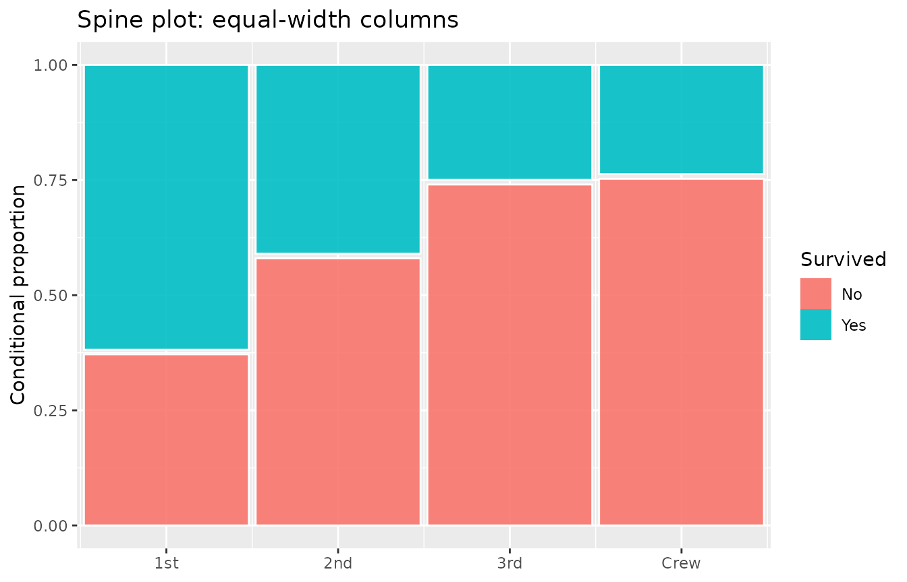

Compare this with the standard Marimekko to see how class sizes differ:

``` r
p_base <- ggplot(titanic) +
  scale_x_mekko() +
  labs(y = "Proportion")

p1 <- p_base +
  geom_mekko(aes(x = Class, fill = Survived, weight = Freq)) +
  labs(title = "Marimekko (proportional widths)")

p2 <- p_base +
  geom_mekko(aes(x = Class, fill = Survived, weight = Freq),
    standardize = TRUE
  ) +
  labs(title = "Spine (equal widths)")

# Side-by-side (requires patchwork or gridExtra)
# p1 + p2
p1
```

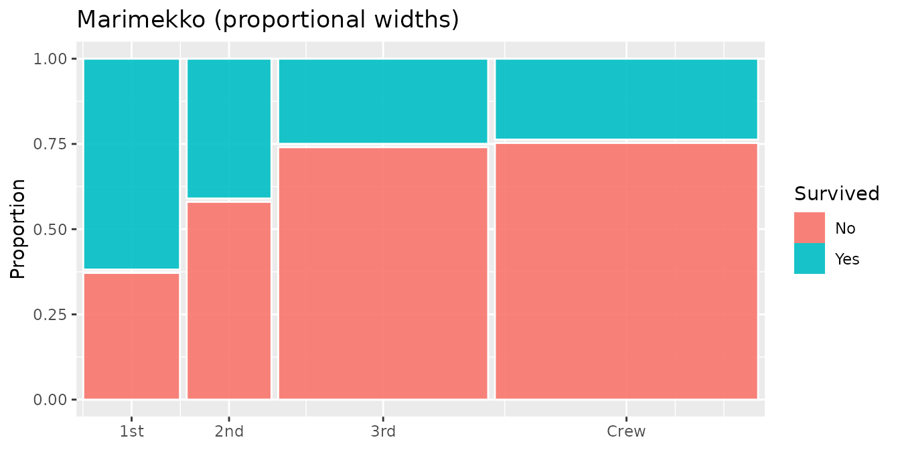

``` r
p2
```

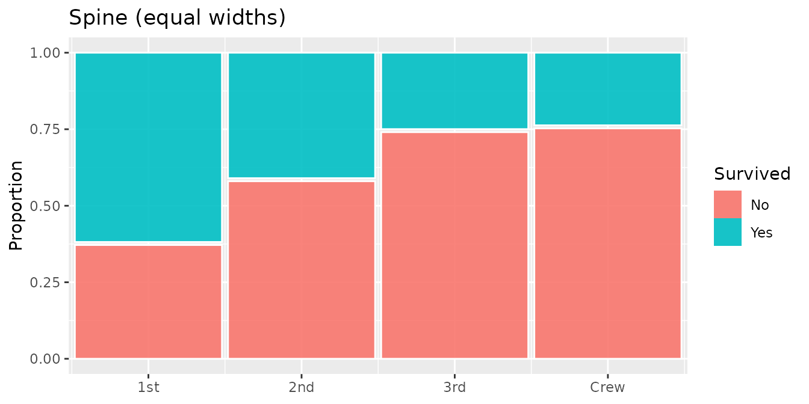

## Pearson residuals

Pearson residuals measure how much each cell deviates from the
independence assumption. Positive residuals indicate more observations
than expected; negative residuals indicate fewer.

Set `residuals = TRUE` to compute residuals. They are exposed as the
`.resid` computed variable, which you can map to an aesthetic via
[`after_stat()`](https://ggplot2.tidyverse.org/reference/aes_eval.html):

``` r
ggplot(titanic) +
  geom_mekko(
    aes(
      x = Class, fill = Survived, weight = Freq,
      alpha = after_stat(abs(.resid))
    ),
    residuals = TRUE
  ) +
  scale_x_mekko() +
  scale_alpha_continuous(range = c(0.3, 1), guide = "none") +
  labs(title = "Residual shading: stronger opacity = larger deviation")
```

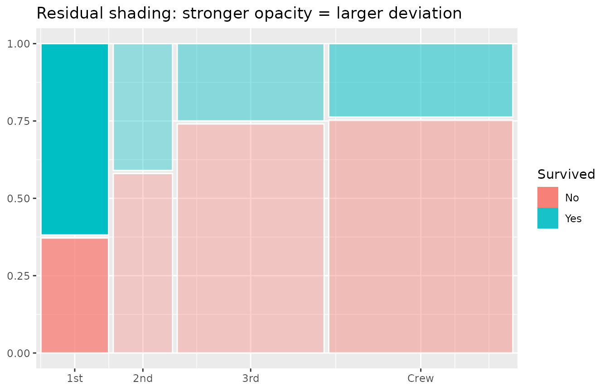

You can also map residuals to colour instead of relying on fill:

``` r
ggplot(titanic) +
  geom_mekko(aes(x = Class, fill = Survived, weight = Freq),
    residuals = TRUE
  ) +
  geom_mekko_text(aes(
    x = Class, fill = Survived, weight = Freq,
    label = after_stat(round(.resid, 1))
  ), residuals = TRUE, colour = "white", size = 3) +
  scale_x_mekko() +
  labs(title = "Pearson residuals as labels")
```

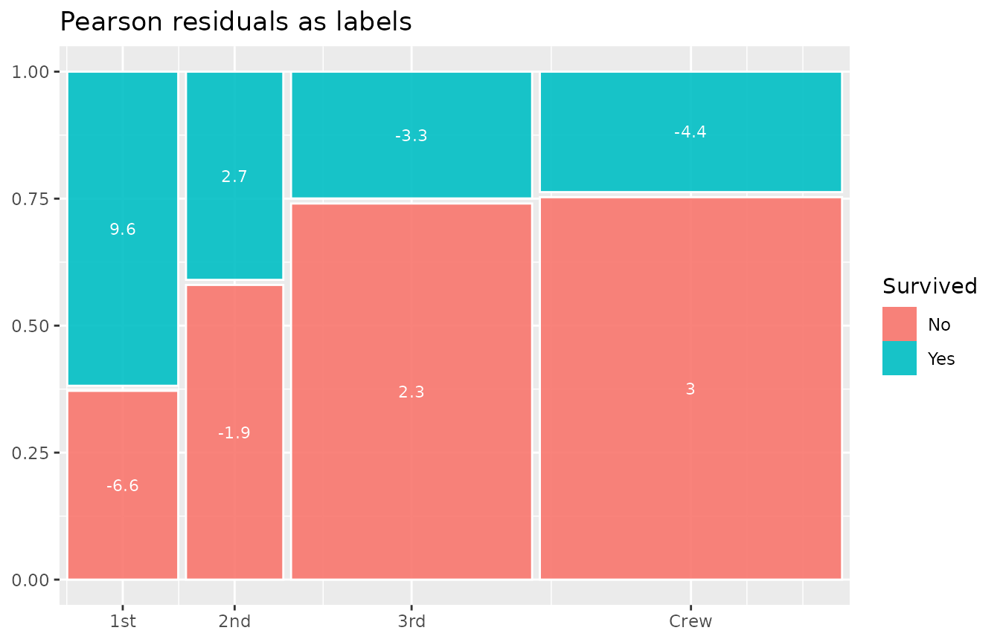

## Chi-squared test annotation

[`annotate_chisq()`](../reference/annotate_chisq.md) runs a chi-squared
test of independence and places the result (test statistic, degrees of
freedom, p-value) as a text annotation:

``` r
ggplot(titanic) +
  geom_mekko(aes(x = Class, fill = Survived, weight = Freq),
    residuals = TRUE
  ) +
  scale_x_mekko() +
  annotate_chisq(titanic, Class, Survived, weight = Freq) +
  labs(title = "Mosaic plot with chi-squared test")
```

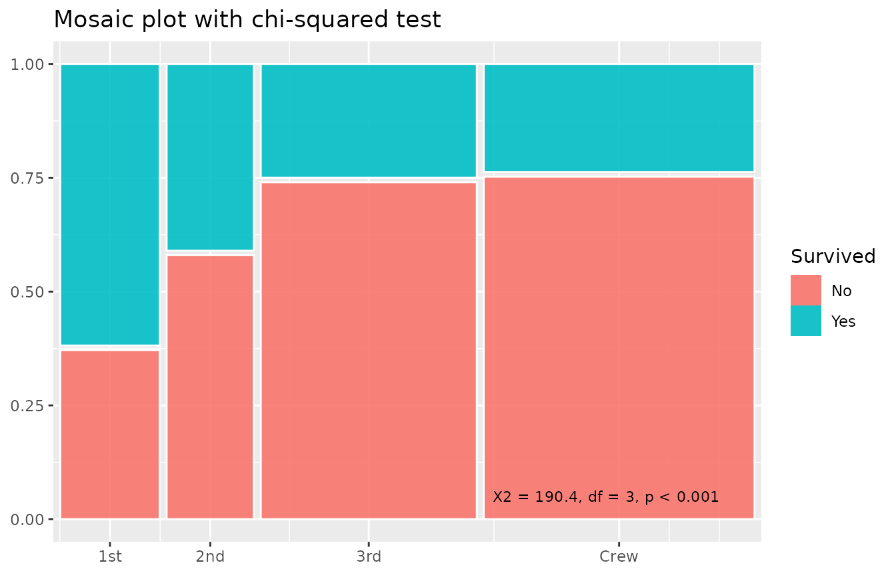

Customize the annotation position and appearance:

``` r
ggplot(titanic) +
  geom_mekko(aes(x = Class, fill = Survived, weight = Freq)) +
  scale_x_mekko() +
  annotate_chisq(titanic, Class, Survived,
    weight = Freq,
    pos_x = 0.5, pos_y = 0.95, hjust = 0.5,
    size = 4, fontface = "italic"
  )
```

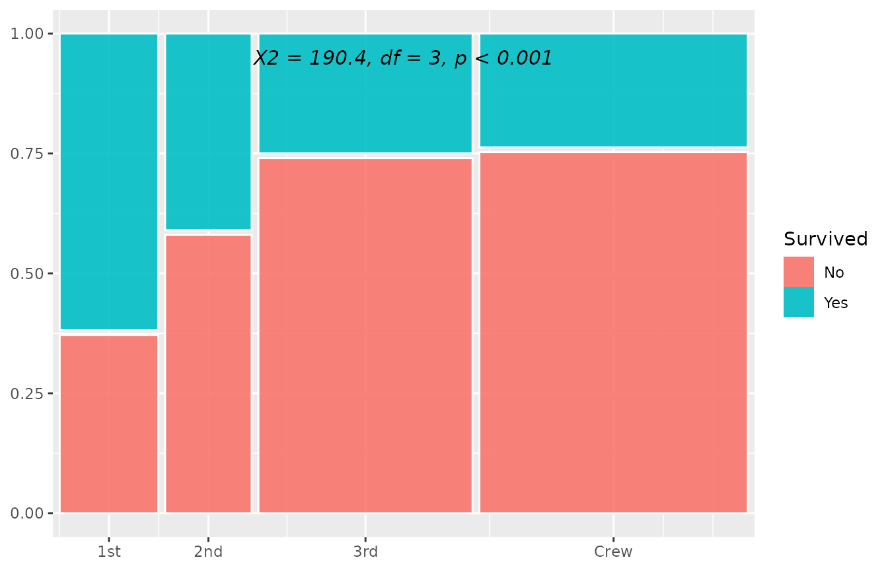

## Jittered points

For small-to-medium datasets,
[`geom_mekko_jitter()`](../reference/geom_mekko_jitter.md) scatters
individual data points inside their corresponding mosaic tile. Each row
is expanded by its weight, so weighted data shows the correct number of
points.

``` r
ucb <- as.data.frame(UCBAdmissions)
ucb_a <- ucb[ucb$Dept == "A", ]

ggplot(ucb_a) +
  geom_mekko(aes(x = Gender, fill = Admit, weight = Freq),
    alpha = 0.3
  ) +
  geom_mekko_jitter(aes(x = Gender, fill = Admit, weight = Freq),
    seed = 42, size = 0.8
  ) +
  scale_x_mekko() +
  labs(title = "UCB admissions, Dept A: individual applicants")
```

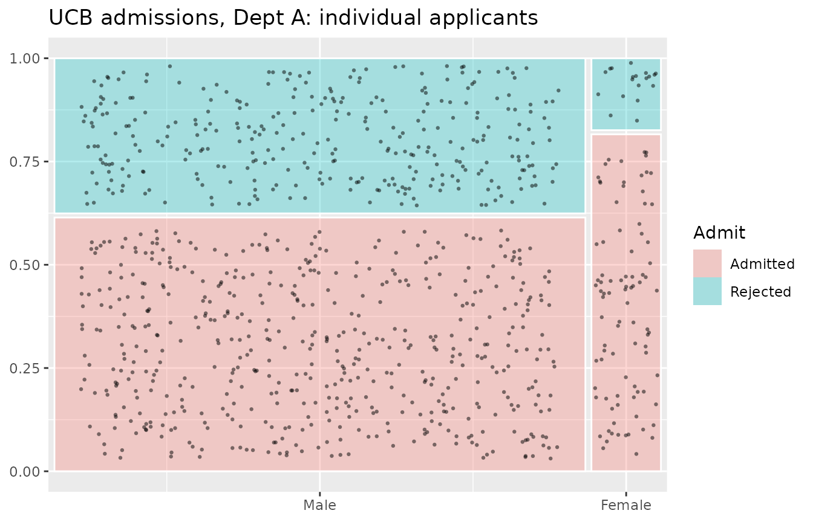

Set `seed` for reproducible jitter placement.

## Three-variable nested mosaic

[`geom_mekko_multi()`](../reference/geom_mekko_multi.md) adds a third
categorical variable (`split`) that subdivides each column horizontally
before stacking `fill` vertically:

- Column widths encode `x` proportions
- Sub-column widths within each column encode conditional `split`
  proportions given `x`
- Segment heights encode conditional `fill` proportions given `x` and
  `split`

``` r
ggplot(titanic) +
  geom_mekko_multi(aes(
    x = Class, split = Sex, fill = Survived, weight = Freq
  )) +
  scale_x_mekko() +
  labs(title = "Nested mosaic: Class > Sex > Survived")
```

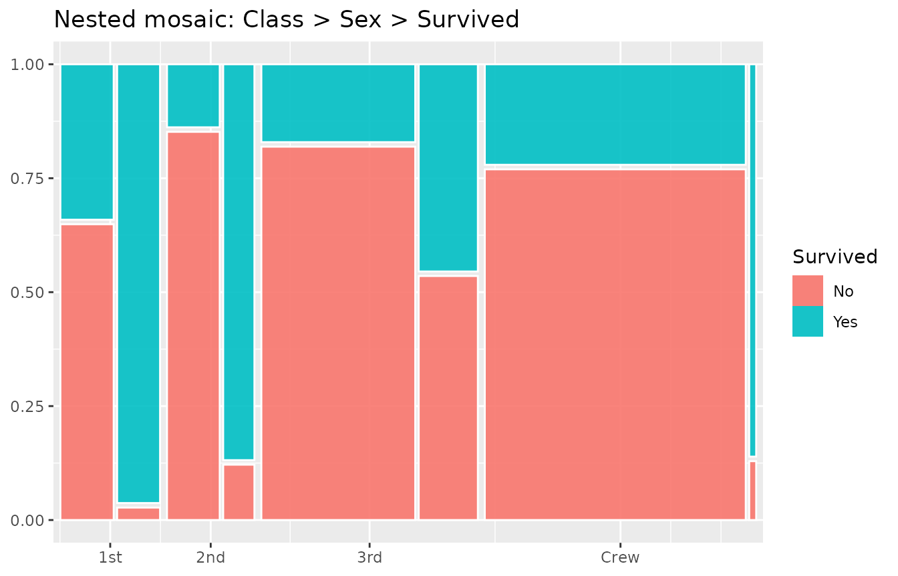

This produces a richer view than faceting because all three variables
share a single coordinate space, making relative proportions directly
comparable.

## Y-axis scale

By default the y-axis shows proportions from 0 to 1.
[`scale_y_mekko()`](../reference/scale_y_mekko.md) replaces that with
fill category labels at segment midpoints:

``` r
ggplot(titanic) +
  geom_mekko(aes(x = Class, fill = Survived, weight = Freq)) +
  scale_x_mekko() +
  scale_y_mekko() +
  labs(title = "Fill labels on y-axis")
```

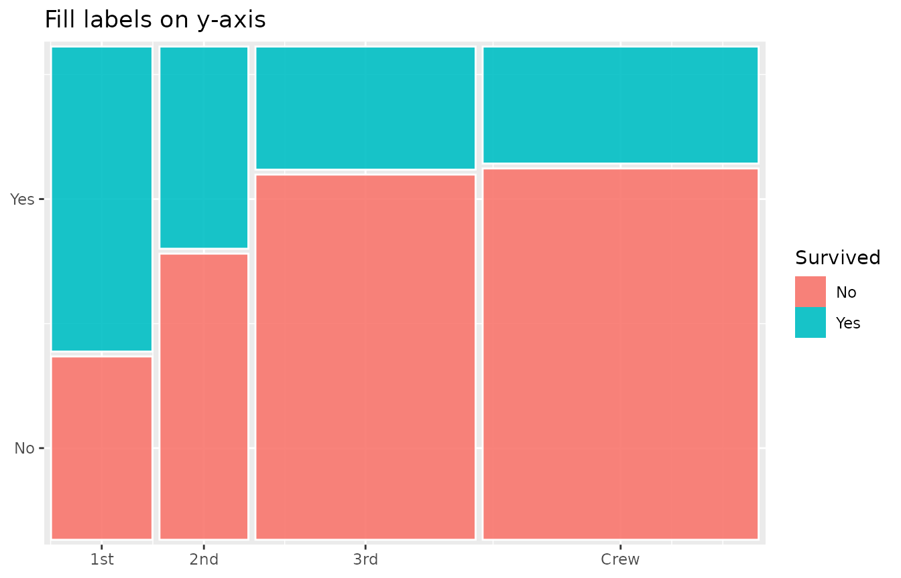

This is most useful when you want to de-emphasize the numeric
proportions and instead label segments directly.

## Data extraction with fortify

[`fortify_mekko()`](../reference/fortify_mekko.md) returns computed tile
positions as a plain data frame without creating a plot. This is useful
for:

- Custom downstream analysis
- Manual ggplot2 layer construction
- Exporting tile coordinates

``` r
tiles <- fortify_mekko(titanic, Class, Survived, weight = Freq)
head(tiles)
#>   x_label fill_label      xmin      xmax      ymin      ymax          x
#> 1     1st         No 0.0000000 0.1432303 0.0000000 0.3716308 0.07161517
#> 5     1st        Yes 0.0000000 0.1432303 0.3816308 1.0000000 0.07161517
#> 2     2nd         No 0.1532303 0.2788323 0.0000000 0.5801053 0.21603135
#> 6     2nd        Yes 0.1532303 0.2788323 0.5901053 1.0000000 0.21603135
#> 3     3rd         No 0.2888323 0.5999727 0.0000000 0.7403966 0.44440254
#> 7     3rd        Yes 0.2888323 0.5999727 0.7503966 1.0000000 0.44440254
#>           y weight cond_prop
#> 1 0.1858154    122 0.3753846
#> 5 0.6908154    203 0.6246154
#> 2 0.2900526    167 0.5859649
#> 6 0.7950526    118 0.4140351
#> 3 0.3701983    528 0.7478754
#> 7 0.8751983    178 0.2521246
```

With residuals:

``` r
tiles_resid <- fortify_mekko(titanic, Class, Survived,
  weight = Freq, residuals = TRUE
)
head(tiles_resid)
#>   x_label fill_label      xmin      xmax      ymin      ymax          x
#> 1     1st         No 0.0000000 0.1432303 0.0000000 0.3716308 0.07161517
#> 5     1st        Yes 0.0000000 0.1432303 0.3816308 1.0000000 0.07161517
#> 2     2nd         No 0.1532303 0.2788323 0.0000000 0.5801053 0.21603135
#> 6     2nd        Yes 0.1532303 0.2788323 0.5901053 1.0000000 0.21603135
#> 3     3rd         No 0.2888323 0.5999727 0.0000000 0.7403966 0.44440254
#> 7     3rd        Yes 0.2888323 0.5999727 0.7503966 1.0000000 0.44440254
#>           y weight cond_prop    .resid
#> 1 0.1858154    122 0.3753846 -6.607873
#> 5 0.6908154    203 0.6246154  9.565772
#> 2 0.2900526    167 0.5859649 -1.867159
#> 6 0.7950526    118 0.4140351  2.702959
#> 3 0.3701983    528 0.7478754  2.289965
#> 7 0.8751983    178 0.2521246 -3.315027
```

The returned columns are:

| Column         | Description                                |
|----------------|--------------------------------------------|
| `x_label`      | Category name for the x variable           |
| `fill_label`   | Category name for the fill variable        |
| `xmin`, `xmax` | Horizontal extent of the tile              |
| `ymin`, `ymax` | Vertical extent of the tile                |
| `x`, `y`       | Tile center coordinates                    |
| `weight`       | Aggregated count                           |
| `cond_prop`    | Conditional proportion within the column   |
| `.resid`       | Pearson residual (when `residuals = TRUE`) |

You can use the fortified data frame to build completely custom plots:

``` r
tiles <- fortify_mekko(titanic, Class, Survived, weight = Freq)

ggplot(tiles) +
  geom_rect(
    aes(
      xmin = xmin, xmax = xmax,
      ymin = ymin, ymax = ymax,
      fill = fill_label
    ),
    colour = "grey30", linewidth = 0.3
  ) +
  geom_text(aes(x = x, y = y, label = weight), size = 3) +
  theme_minimal() +
  labs(fill = "Survived")
```

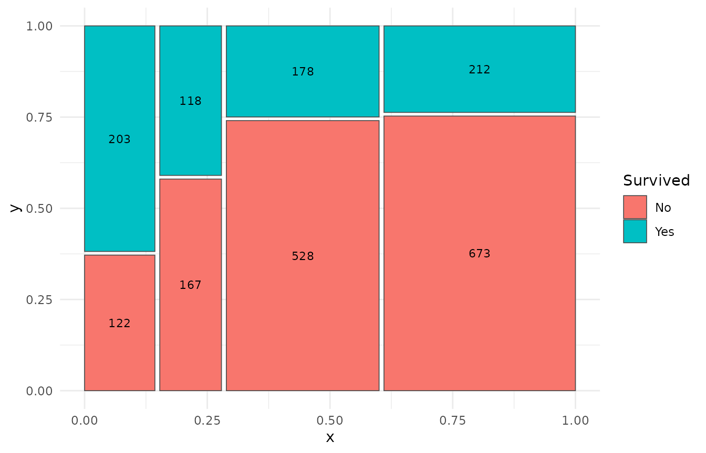

## Combining layers

Because `mekko` produces standard ggplot2 layers, you can freely combine
multiple features:

``` r
ggplot(titanic) +
  geom_mekko(
    aes(
      x = Class, fill = Survived, weight = Freq,
      alpha = after_stat(abs(.resid))
    ),
    residuals = TRUE
  ) +
  geom_mekko_text(aes(
    x = Class, fill = Survived, weight = Freq,
    label = after_stat(weight)
  ), colour = "white", size = 3.5) +
  scale_x_mekko(show_percentages = TRUE) +
  scale_alpha_continuous(range = c(0.4, 1), guide = "none") +
  annotate_chisq(titanic, Class, Survived, weight = Freq) +
  theme_mekko() +
  labs(
    title = "Full-featured mosaic plot",
    subtitle = "Residual shading + counts + marginal % + chi-squared test",
    y = "Proportion"
  )
```

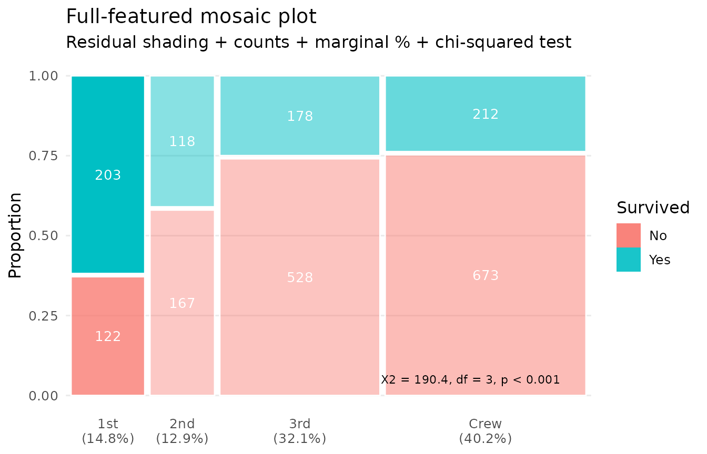

## Independent x/y gaps

By default, `gap` controls both horizontal (between columns) and
vertical (between segments) spacing. Use `gap_x` and `gap_y` to set them
independently:

``` r
ggplot(titanic) +
  geom_mekko(aes(x = Class, fill = Survived, weight = Freq),
    gap_x = 0.04, gap_y = 0
  ) +
  scale_x_mekko() +
  labs(title = "Wide column gaps, no vertical gaps")
```

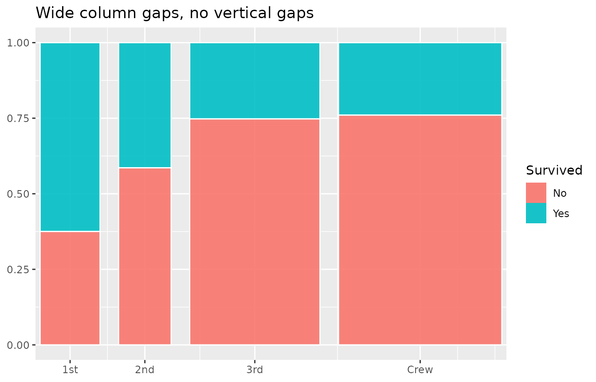

``` r
ggplot(titanic) +
  geom_mekko(aes(x = Class, fill = Survived, weight = Freq),
    gap_x = 0, gap_y = 0.03
  ) +
  scale_x_mekko() +
  labs(title = "No column gaps, visible vertical gaps")
```

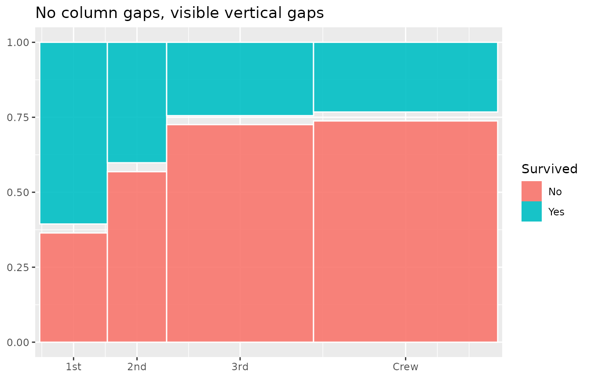

## Plotly interactive tooltips

`StatMarimekko` computes a `.tooltip` variable containing a formatted
summary of each tile (category names, count, and proportion). Map it to
the `text` aesthetic for use with `plotly::ggplotly()`:

``` r
library(plotly)

p <- ggplot(titanic) +
  geom_mekko(aes(
    x = Class, fill = Survived, weight = Freq,
    text = after_stat(.tooltip)
  )) +
  scale_x_mekko()
ggplotly(p, tooltip = "text")
```

The `.tooltip` variable is also available via
[`after_stat()`](https://ggplot2.tidyverse.org/reference/aes_eval.html)
for custom label construction.

## In-aesthetic expressions

Unlike some mosaic packages, `mekko` supports standard ggplot2 tidy
evaluation inside
[`aes()`](https://ggplot2.tidyverse.org/reference/aes.html). You can
transform variables inline:

``` r
ggplot(mtcars) +
  geom_mekko(aes(x = factor(cyl), fill = factor(gear))) +
  scale_x_mekko() +
  labs(
    x = "Cylinders", fill = "Gears",
    title = "factor() inside aes() works"
  )
```

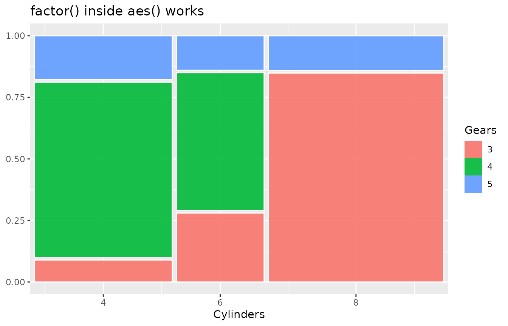

## Namespace-qualified usage

`mekko` works correctly when called with `::` notation (e.g.,
[`mekko::geom_mekko()`](../reference/geom_mekko.md)) without requiring
[`library(mekko)`](https://rdrr.io/r/base/library.html). This makes it
safe to use inside other packages via `Imports` rather than `Depends`.

## Summary of parameters

| Parameter          | Used in                                                                                                                                                                                                                                                                                                                                  | Description                                   |
|--------------------|------------------------------------------------------------------------------------------------------------------------------------------------------------------------------------------------------------------------------------------------------------------------------------------------------------------------------------------|-----------------------------------------------|
| `gap`              | [`geom_mekko()`](../reference/geom_mekko.md), [`geom_mekko_text()`](../reference/geom_mekko_text.md), [`geom_mekko_label()`](../reference/geom_mekko_label.md), [`geom_mekko_jitter()`](../reference/geom_mekko_jitter.md), [`geom_mekko_multi()`](../reference/geom_mekko_multi.md), [`fortify_mekko()`](../reference/fortify_mekko.md) | Spacing between tiles (fraction of plot area) |
| `gap_x`            | All geom/stat/fortify functions                                                                                                                                                                                                                                                                                                          | Horizontal gap (overrides `gap` for x)        |
| `gap_y`            | All geom/stat/fortify functions                                                                                                                                                                                                                                                                                                          | Vertical gap (overrides `gap` for y)          |
| `standardize`      | [`geom_mekko()`](../reference/geom_mekko.md), [`geom_mekko_text()`](../reference/geom_mekko_text.md), [`geom_mekko_label()`](../reference/geom_mekko_label.md), [`geom_mekko_jitter()`](../reference/geom_mekko_jitter.md), [`fortify_mekko()`](../reference/fortify_mekko.md)                                                           | Equal-width columns (spine plot)              |
| `residuals`        | [`geom_mekko()`](../reference/geom_mekko.md), [`geom_mekko_text()`](../reference/geom_mekko_text.md), [`geom_mekko_label()`](../reference/geom_mekko_label.md), [`fortify_mekko()`](../reference/fortify_mekko.md)                                                                                                                       | Compute Pearson residuals                     |
| `seed`             | [`geom_mekko_jitter()`](../reference/geom_mekko_jitter.md)                                                                                                                                                                                                                                                                               | Reproducible jitter placement                 |
| `show_percentages` | [`scale_x_mekko()`](../reference/scale_x_mekko.md)                                                                                                                                                                                                                                                                                       | Append marginal % to x-axis labels            |
