# Getting started with mekko

## What is a Marimekko plot?

A Marimekko (or mosaic) plot is a two-dimensional visualization of a
contingency table. Each column represents a category of one variable,
and the segments within each column represent categories of a second
variable: - **Column widths** are proportional to the marginal counts of
the x variable. - **Segment heights** within each column are
proportional to the conditional counts of the fill variable given x.

The `mekko` package provides this as a native ggplot2 layer, so you can
combine it with any other ggplot2 functionality (facets, themes,
annotations, etc.).

## Installation

``` r
# From CRAN
install.packages("mekko")

# From GitHub (when published)
devtools::install_github("gogonzo/mekko")
```

## Your first Marimekko plot

The built-in `Titanic` dataset records survival counts by class, sex,
and age. Let’s visualize survival by passenger class.

``` r
library(ggplot2)
library(mekko)

titanic <- as.data.frame(Titanic)

ggplot(titanic) +
  geom_mekko(aes(x = Class, fill = Survived, weight = Freq)) +
  scale_x_mekko() +
  labs(title = "Titanic survival by class", y = "Proportion")
```

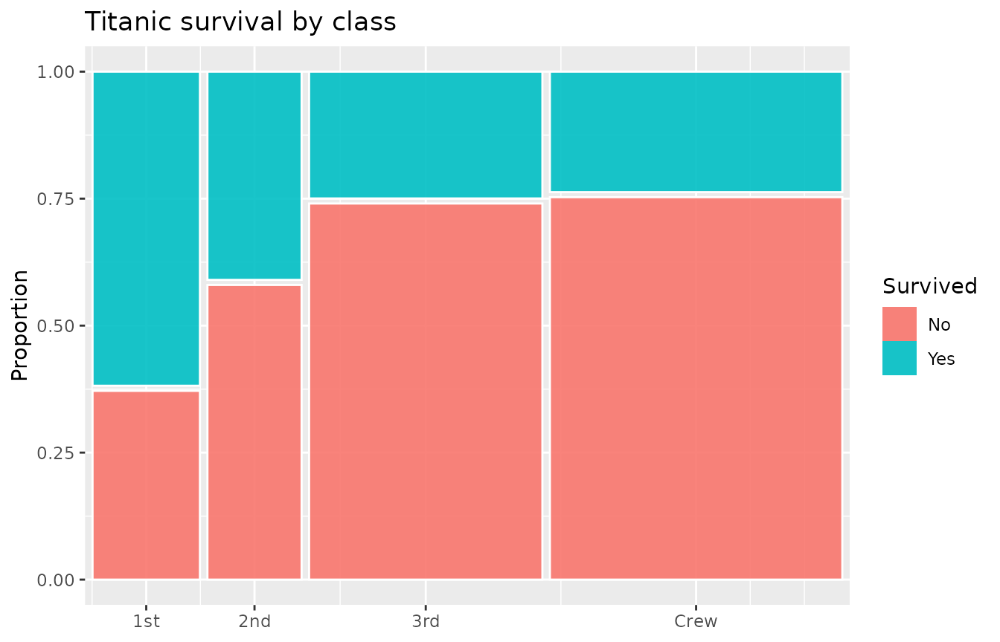

Three components are at work:

1.  **[`geom_mekko()`](../reference/geom_mekko.md)** computes tile
    positions from your data. The `x` aesthetic defines the columns,
    `fill` defines the segments, and `weight` provides the counts.
2.  **[`scale_x_mekko()`](../reference/scale_x_mekko.md)** labels the
    x-axis with category names at each column’s midpoint.
3.  Standard ggplot2 functions
    ([`labs()`](https://ggplot2.tidyverse.org/reference/labs.html),
    [`theme()`](https://ggplot2.tidyverse.org/reference/theme.html),
    etc.) work as usual.

## Aesthetics

[`geom_mekko()`](../reference/geom_mekko.md) understands these
aesthetics:

| Aesthetic | Required | Description                       |
|-----------|----------|-----------------------------------|
| `x`       | yes      | Categorical variable for columns  |
| `fill`    | yes      | Categorical variable for segments |
| `weight`  | no       | Numeric weight/count (default 1)  |

If your data already has one row per observation (no aggregation
needed), omit `weight`:

``` r
ggplot(mtcars) +
  geom_mekko(aes(x = factor(cyl), fill = factor(gear))) +
  scale_x_mekko() +
  labs(x = "Cylinders", fill = "Gears")
```

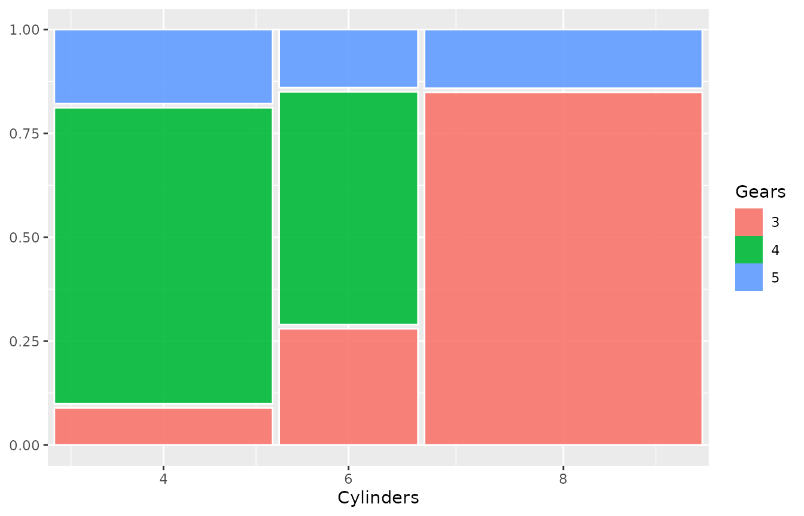

## Gap control

The `gap` parameter controls spacing between tiles as a fraction of the
plot area. Default is `0.01`.

``` r
ggplot(titanic) +
  geom_mekko(aes(x = Class, fill = Survived, weight = Freq),
    gap = 0.03
  ) +
  scale_x_mekko() +
  labs(title = "Wider gaps (gap = 0.03)")
```

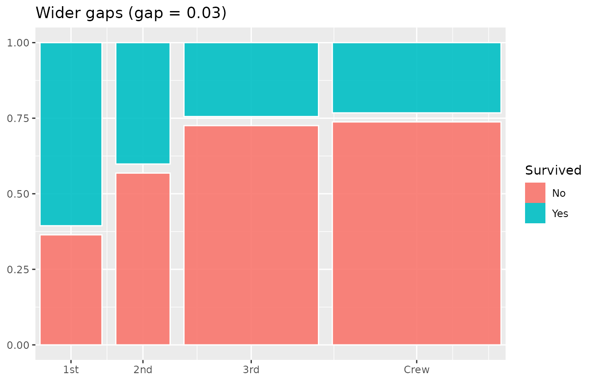

Set `gap = 0` for a seamless mosaic:

``` r
ggplot(titanic) +
  geom_mekko(aes(x = Class, fill = Survived, weight = Freq),
    gap = 0
  ) +
  scale_x_mekko() +
  labs(title = "No gaps")
```

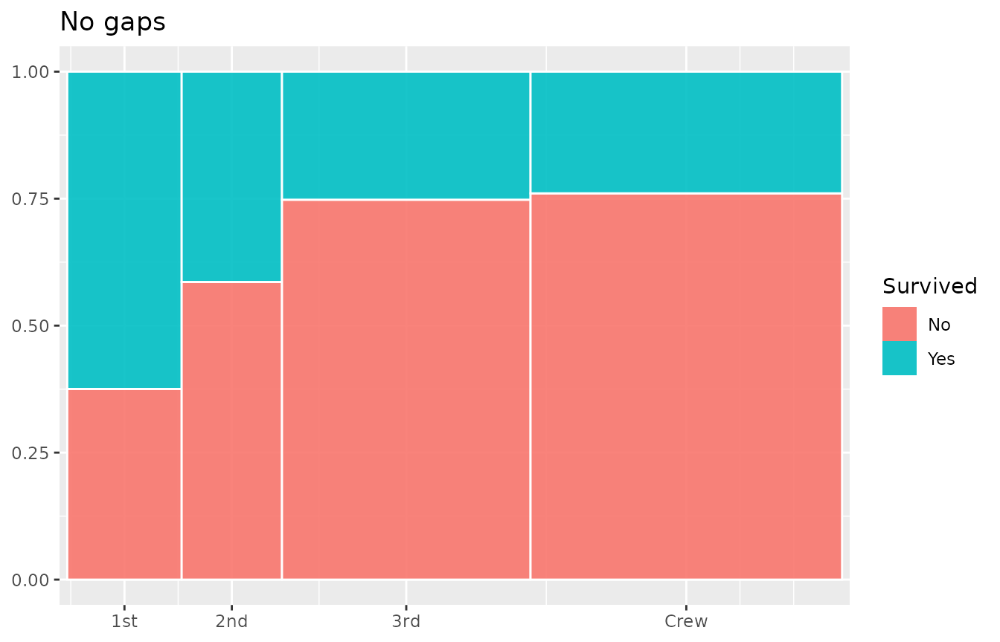

## Marginal percentages

[`scale_x_mekko()`](../reference/scale_x_mekko.md) can append marginal
percentages to the x-axis labels:

``` r
ggplot(titanic) +
  geom_mekko(aes(x = Class, fill = Survived, weight = Freq)) +
  scale_x_mekko(show_percentages = TRUE) +
  labs(y = "Proportion")
```

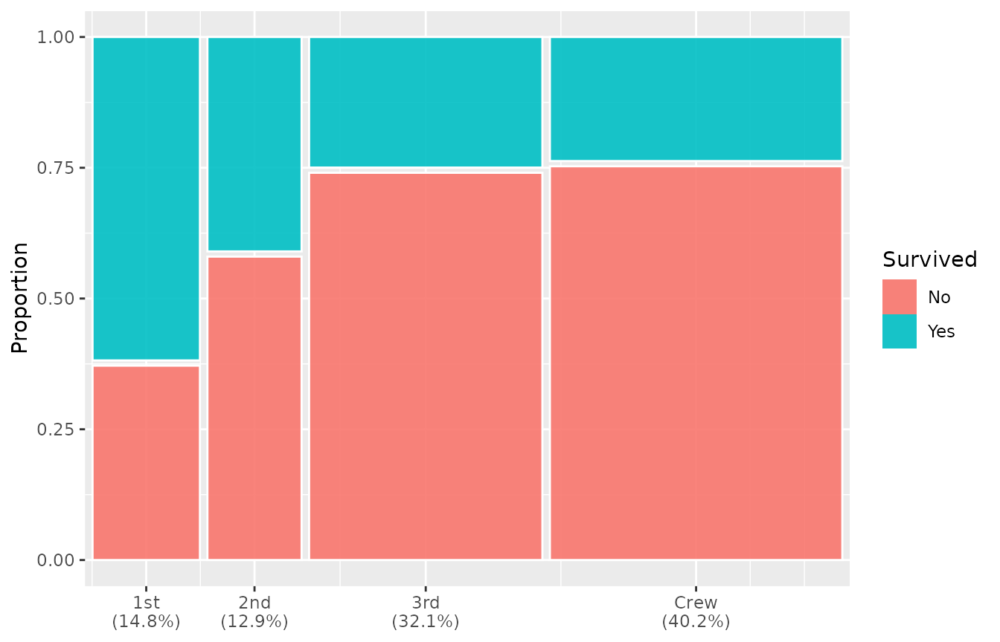

## Adding text labels

Use [`geom_mekko_text()`](../reference/geom_mekko_text.md) (or
[`geom_mekko_label()`](../reference/geom_mekko_label.md) for a boxed
version) to place labels at tile centers. The `label` aesthetic can
reference computed variables via
[`after_stat()`](https://ggplot2.tidyverse.org/reference/aes_eval.html):

- `weight` – the aggregated count for the tile
- `cond_prop` – the conditional proportion within the column
- `x_label` – the x category name
- `fill_label` – the fill category name

``` r
ggplot(titanic) +
  geom_mekko(aes(x = Class, fill = Survived, weight = Freq)) +
  geom_mekko_text(aes(
    x = Class, fill = Survived, weight = Freq,
    label = after_stat(weight)
  ), colour = "white") +
  scale_x_mekko() +
  labs(title = "Counts inside tiles")
```

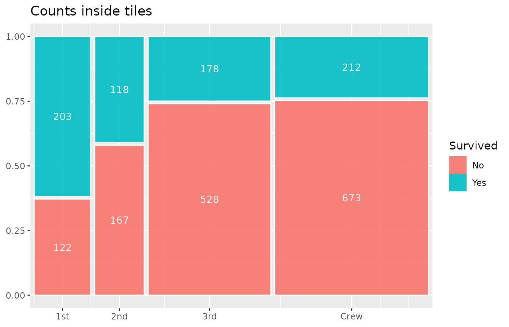

Percentage labels:

``` r
ggplot(titanic) +
  geom_mekko(aes(x = Class, fill = Survived, weight = Freq)) +
  geom_mekko_text(aes(
    x = Class, fill = Survived, weight = Freq,
    label = after_stat(paste0(round(cond_prop * 100), "%"))
  ), colour = "white", size = 3) +
  scale_x_mekko()
```

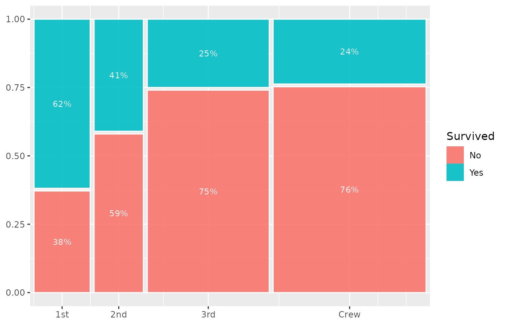

## Theming

[`theme_mekko()`](../reference/theme_mekko.md) provides a clean, minimal
theme that removes distracting x-axis gridlines:

``` r
ggplot(titanic) +
  geom_mekko(aes(x = Class, fill = Survived, weight = Freq)) +
  scale_x_mekko() +
  theme_mekko() +
  labs(title = "With theme_mekko()")
```

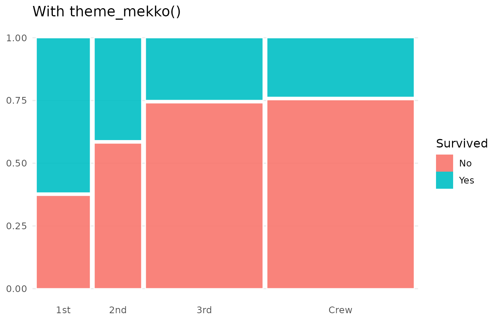

Since it builds on
[`theme_minimal()`](https://ggplot2.tidyverse.org/reference/ggtheme.html),
you can override any element:

``` r
ggplot(titanic) +
  geom_mekko(aes(x = Class, fill = Survived, weight = Freq)) +
  scale_x_mekko() +
  theme_mekko() +
  theme(legend.position = "bottom")
```

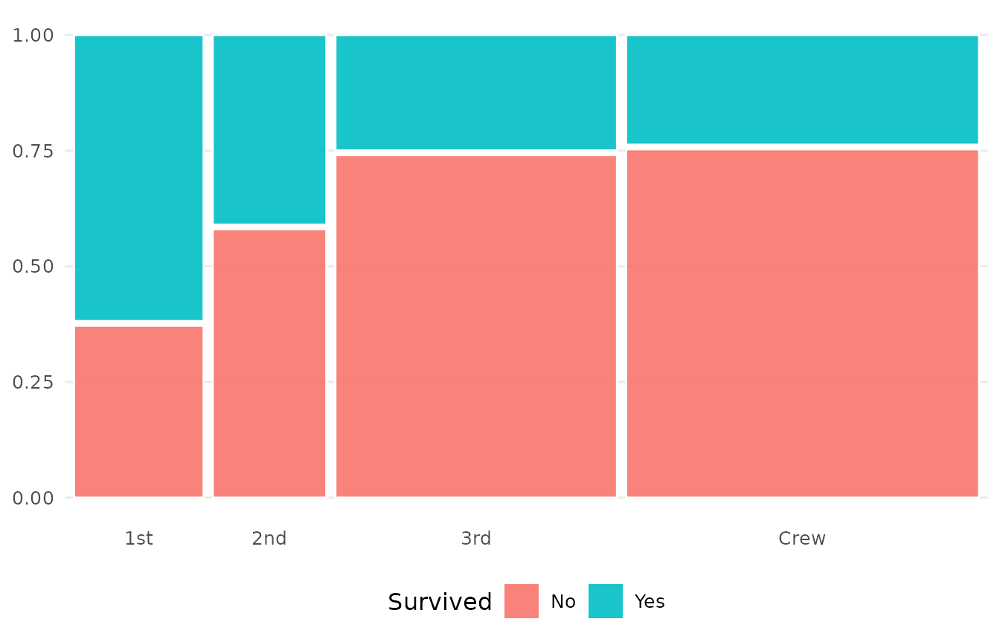

## Faceting

[`geom_mekko()`](../reference/geom_mekko.md) supports ggplot2 faceting.
Each panel gets its own independently proportioned mosaic:

``` r
ggplot(as.data.frame(Titanic)) +
  geom_mekko(aes(x = Class, fill = Survived, weight = Freq)) +
  scale_x_mekko() +
  facet_wrap(~Sex) +
  labs(title = "Survival by class, faceted by sex")
```

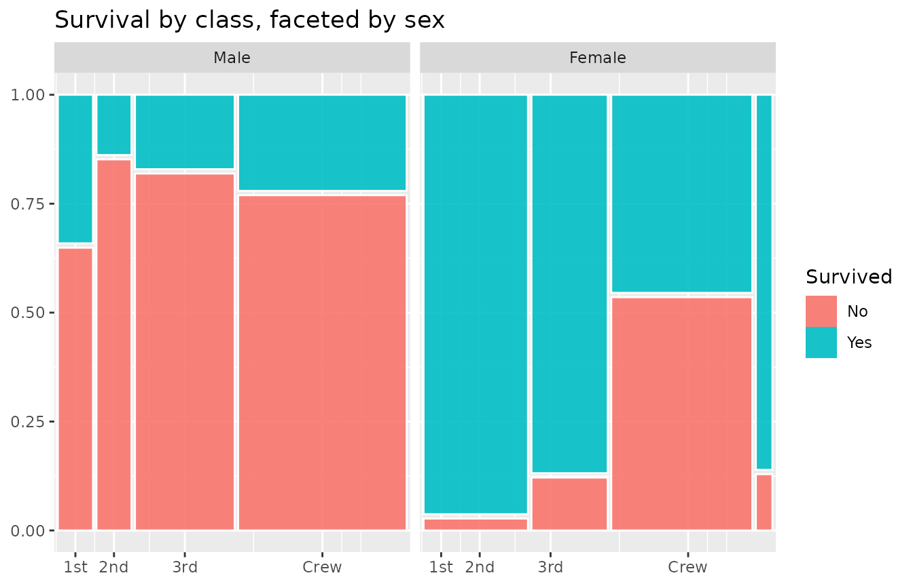

## Custom colours

Since `fill` is a standard ggplot2 aesthetic, any fill scale works:

``` r
haireye <- as.data.frame(HairEyeColor[, , 1])

ggplot(haireye) +
  geom_mekko(aes(x = Hair, fill = Eye, weight = Freq)) +
  scale_x_mekko() +
  scale_fill_brewer(palette = "Set2") +
  labs(title = "Hair vs Eye colour (males)")
```

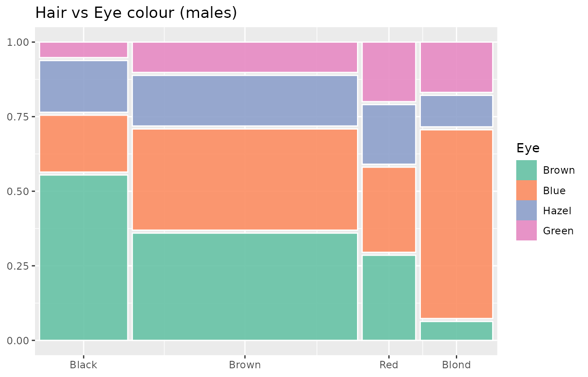

## Next steps

See [`vignette("advanced-features")`](../articles/advanced-features.md)
for spine plots, Pearson residuals, jittered points, three-variable
mosaics, and programmatic data extraction with
[`fortify_mekko()`](../reference/fortify_mekko.md).
