# Migrating from ggmosaic to marimekko

## Why migrate?

[ggmosaic](https://github.com/haleyjeppson/ggmosaic) was archived from
CRAN on 2025-11-10 due to uncorrected issues. Key problems included
reliance on internal ggplot2 APIs that broke on updates and a dependency
on deprecated tidyr functions.

**marimekko** is a from-scratch replacement that uses only public
ggplot2 APIs, depends only on ggplot2 and rlang, and follows standard
ggplot2 aesthetic conventions.

The examples below are adapted from [Jeppson & Hofmann
(2023)](https://journal.r-project.org/articles/RJ-2023-013/), showing
each ggmosaic pattern and its marimekko equivalent.

## Function mapping

| ggmosaic                | marimekko                                                        | Notes                                                                                                            |
|-------------------------|------------------------------------------------------------------|------------------------------------------------------------------------------------------------------------------|
| `geom_mosaic()`         | [`geom_marimekko()`](../reference/geom_marimekko.md)             | Standard [`aes()`](https://ggplot2.tidyverse.org/reference/aes.html), no `product()`                             |
| `geom_mosaic_text()`    | [`geom_marimekko_text()`](../reference/geom_marimekko_text.md)   |                                                                                                                  |
| `theme_mosaic()`        | [`theme_marimekko()`](../reference/theme_marimekko.md)           |                                                                                                                  |
| `scale_x_productlist()` | *not needed*                                                     | Axis labels are automatic; use `show_percentages = TRUE` in [`geom_marimekko()`](../reference/geom_marimekko.md) |
| `scale_y_productlist()` | *not needed*                                                     | Axis labels are automatic                                                                                        |
| `product()`             | *not needed*                                                     | Use `formula = ~ a \| b`                                                                                         |
| —                       | [`geom_marimekko_label()`](../reference/geom_marimekko_label.md) | New: text with background box                                                                                    |
| —                       | [`fortify_marimekko()`](../reference/fortify_marimekko.md)       | New: extract tile data as data frame                                                                             |

## Side-by-side examples

The ggmosaic paper (Jeppson & Hofmann, 2023, *The R Journal* 14(4)) uses
the `fly` dataset from ggmosaic and the built-in `Titanic` dataset.
Since ggmosaic is no longer on CRAN, we recreate the `fly`-based
examples using `Titanic` and `HairEyeColor` — both built-in R datasets
that need no extra packages.

### One dimensional — spine plot and bar chart

The paper starts with single-variable plots showing different divider
types (Figure 1 in Jeppson & Hofmann, 2023):

``` r
# ggmosaic — spine plot (one variable, default divider)
ggplot(data = titanic) +
  geom_mosaic(aes(x = product(Class), fill = Class, weight = Freq))
```

``` r
# marimekko — one variable
ggplot(titanic) +
  geom_marimekko(aes(fill = Class, weight = Freq), formula = ~Class) +
  theme_marimekko() +
  labs(title = "One variable: f(Class)")
```

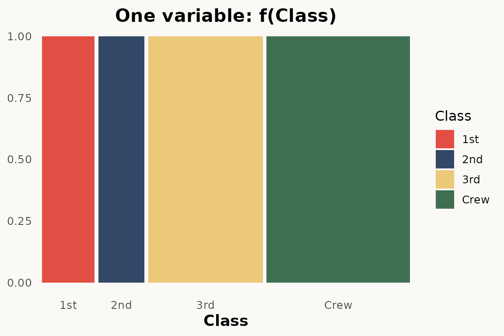

``` r
# ggmosaic — bar chart (one variable, hbar divider)
ggplot(data = titanic) +
  geom_mosaic(
    aes(x = product(Class), fill = Class, weight = Freq),
    divider = "hbar"
  )
```

``` r
# ggplot — barchart
# todo: needs percentage y scale
ggplot(titanic) +
  geom_bar(aes(Class, weight = Freq, fill = Class)) +
  theme_marimekko() +
  labs(title = "One variable: f(Class)")
```

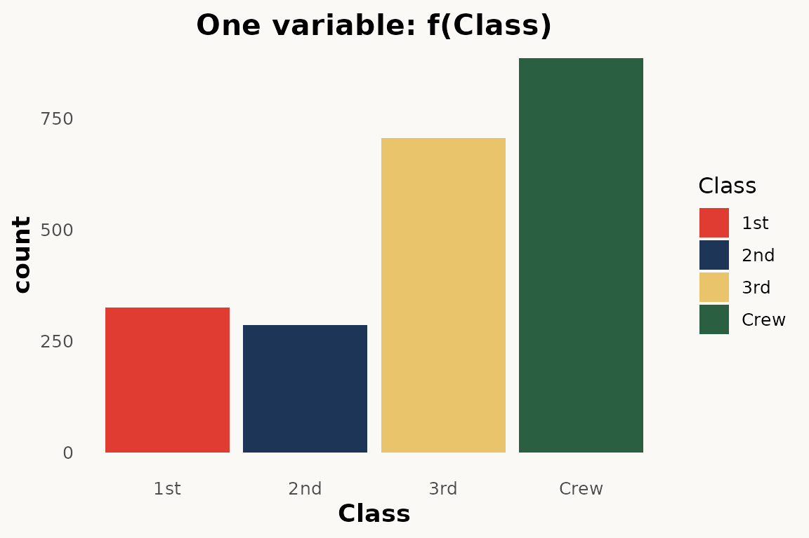

The main difference: **no `product()` wrapper** — use `formula = ~ Var`
instead. marimekko does not have a `divider` argument; it always
produces vertical columns with horizontal stacking.

### Two dimensional — mosaic plot and stacked bar chart

The paper shows two-dimensional mosaic plots where variable order in
`product()` controls the partitioning hierarchy (Figure 2):

``` r
# ggmosaic — two variables
ggplot(data = titanic) +
  geom_mosaic(aes(
    x = product(Class),
    fill = Survived,
    weight = Freq
  ))
```

``` r
# marimekko — two variables via formula
ggplot(titanic) +
  geom_marimekko(aes(fill = Survived, weight = Freq),
    formula = ~ Class | Survived
  ) +
  theme_marimekko() +
  labs(title = "Two variables: f(Survived | Class) f(Class)")
```

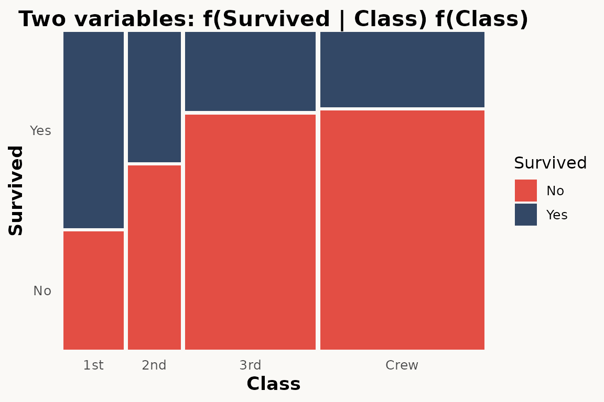

### Three dimensional

The paper shows two-dimensional mosaic plots where variable order in
`product()` controls the partitioning hierarchy (Figure 3):

``` r
# ggmosaic — double-decker variables
ggplot(data = titanic) +
  geom_mosaic(aes(
    x = product(Survived, Class, Sex),
    fill = Survived,
    weight = Freq,
  ), divider = ddecker())
```

``` r
# marimekko — three variables via formula
ggplot(titanic) +
  geom_marimekko(aes(fill = Survived, weight = Freq),
    formula = ~ Sex + Class | Survived
  ) +
  theme_marimekko() +
  labs(title = "Three variables: f(Survived | Class, Sex)")
```

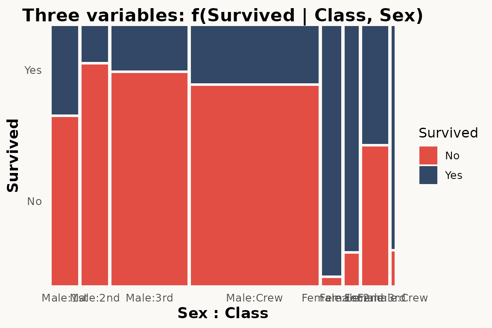

### Three variables — nested mosaic

The paper demonstrates three-variable mosaics where a third variable
adds another level of partitioning (Figure 4):

``` r
# ggmosaic — three variables via product()
ggplot(data = titanic) +
  geom_mosaic(aes(
    x = product(Sex, Survived, Class),
    fill = Survived,
    weight = Freq
  ))
```

``` r
# marimekko — three variables via formula
ggplot(titanic) +
  geom_marimekko(aes(fill = Survived, weight = Freq),
    formula = ~ Class | Survived | Sex
  ) +
  theme_marimekko() +
  labs(title = "Three variables: Class / Sex / Survived")
```

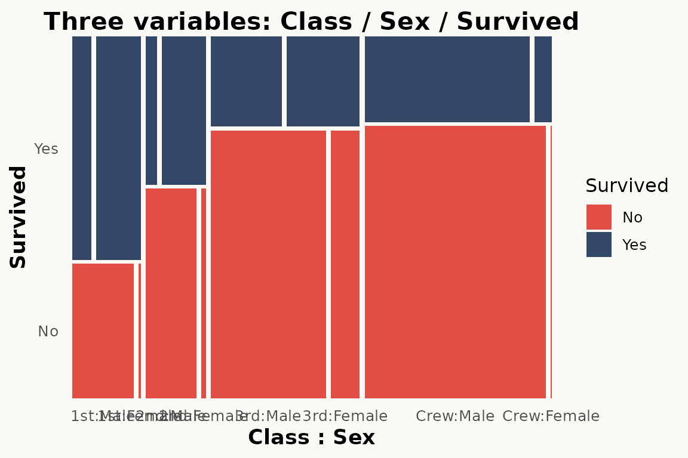

### Conditioning with `conds`

The paper shows how `conds` creates conditional distributions (Section
3.2):

``` r
# ggmosaic — conditioning
ggplot(data = titanic) +
  geom_mosaic(aes(
    x = product(Class),
    fill = Survived,
    weight = Freq,
    conds = product(Sex)
  ))
```

marimekko does not have a `conds` aesthetic. Use
[`facet_wrap()`](https://ggplot2.tidyverse.org/reference/facet_wrap.html)
instead:

``` r
# marimekko — conditioning via faceting
ggplot(titanic) +
  geom_marimekko(aes(fill = Survived, weight = Freq),
    formula = ~ Class | Survived
  ) +
  facet_wrap(~Sex) +
  theme_marimekko() +
  labs(title = "f(Survived | Class) conditioned on Sex")
```

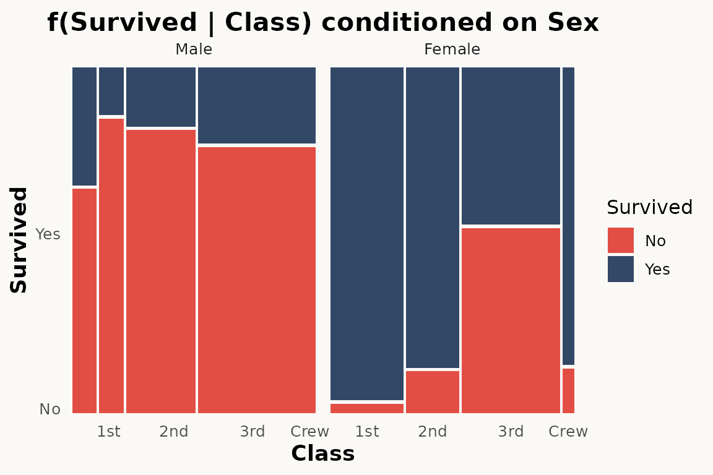

### Faceting

The paper demonstrates
[`facet_grid()`](https://ggplot2.tidyverse.org/reference/facet_grid.html)
as an alternative to conditioning (Section 3.3):

``` r
# ggmosaic — faceting
ggplot(data = titanic) +
  geom_mosaic(aes(
    x = product(Class), fill = Survived, weight = Freq
  )) +
  facet_grid(~Sex)
```

``` r
# marimekko — faceting works the same way
ggplot(titanic) +
  geom_marimekko(aes(fill = Survived, weight = Freq),
    formula = ~ Class | Survived
  ) +
  facet_wrap(~Sex) +
  theme_marimekko() +
  labs(title = "Mosaic faceted by Sex")
```

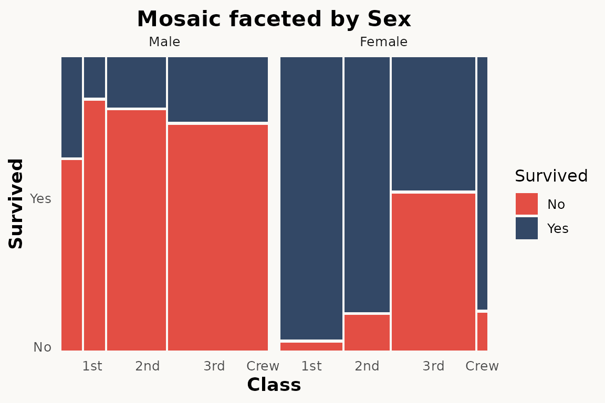

### Divider types and `standardize`

The paper describes four fundamental partition types: `hspine`,
`vspine`, `hbar`, and `vbar` (Section 4, Figure 5). These are combined
to produce spine plots, stacked bar charts, mosaic plots, and double
decker plots.

marimekko simplifies this —
[`geom_marimekko()`](../reference/geom_marimekko.md) always starts with
horizontal splits and alternates direction with each `|` in the formula.
Use
[`coord_flip()`](https://ggplot2.tidyverse.org/reference/coord_flip.html)
if you need vertical-first orientation.

For equal-width columns (spine-plot style), `standardize = TRUE` is
available in
[`geom_marimekko_text()`](../reference/geom_marimekko_text.md) and
[`fortify_marimekko()`](../reference/fortify_marimekko.md).

``` r
# ggmosaic — spine plot via divider
ggplot(titanic) +
  geom_mosaic(aes(x = product(Class), fill = Survived, weight = Freq),
    divider = c("vspine", "hspine")
  )
```

``` r
# marimekko — proportional-width columns (default)
ggplot(titanic) +
  geom_marimekko(aes(fill = Survived, weight = Freq),
    formula = ~ Class | Survived
  ) +
  theme_marimekko() +
  labs(title = "Mosaic plot (proportional-width columns)")
```

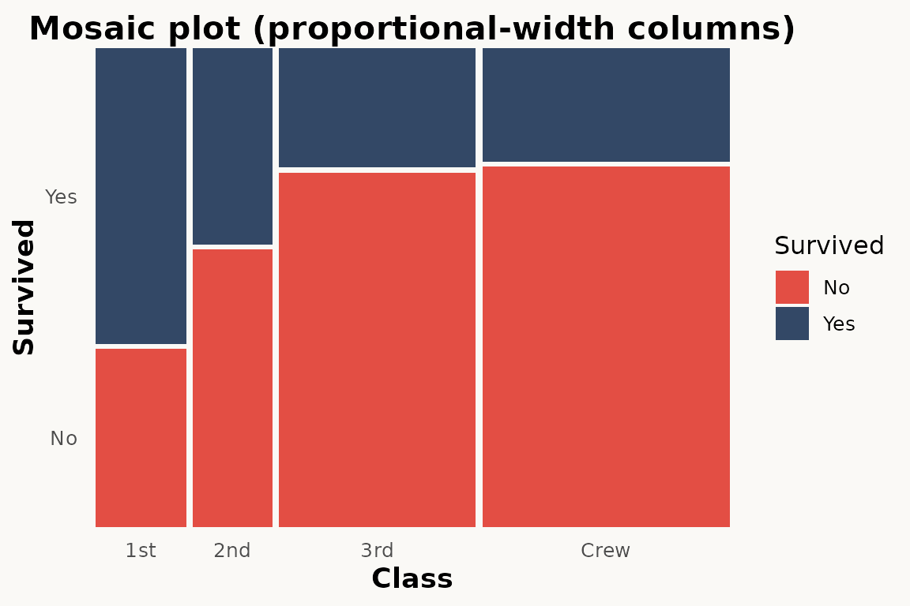

### Offset / spacing

The paper shows how `offset` controls gaps between tiles (Section 5):

``` r
# ggmosaic — single offset parameter
ggplot(data = titanic) +
  geom_mosaic(aes(
    x = product(Class), fill = Survived, weight = Freq
  ), offset = 0.02)
```

marimekko provides independent `gap_x` and `gap_y` parameters:

``` r
# marimekko — no gaps
ggplot(titanic) +
  geom_marimekko(aes(fill = Survived, weight = Freq),
    formula = ~ Class | Survived, gap_x = 0.02, gap_y = 0.02
  ) +
  theme_marimekko() +
  labs(title = "No gaps")
```

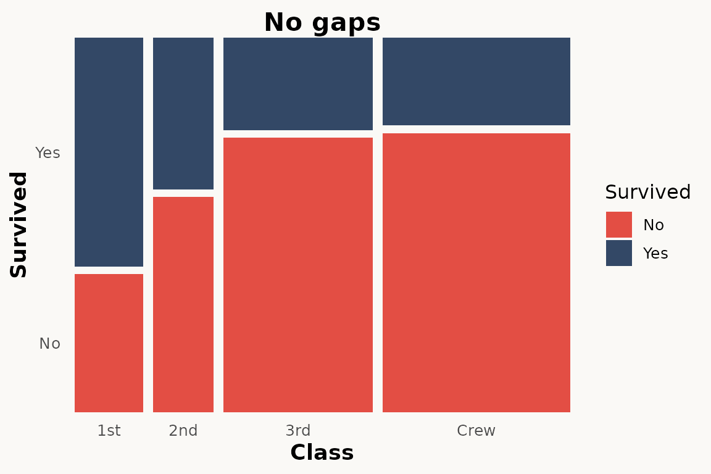

### Text labels

The paper shows `geom_mosaic_text()` for adding labels (Section 7):

``` r
# ggmosaic — automatic text labels
ggplot(titanic) +
  geom_mosaic(aes(x = product(Class), fill = Survived, weight = Freq)) +
  geom_mosaic_text(aes(x = product(Class), fill = Survived, weight = Freq))
```

``` r
# marimekko — automatic tile positions, only label needed
ggplot(titanic) +
  geom_marimekko(aes(fill = Survived, weight = Freq),
    formula = ~ Class | Survived
  ) +
  geom_marimekko_text(aes(
    label = after_stat(paste(Class, Survived, sep = "\n"))
  )) +
  theme_marimekko()
```

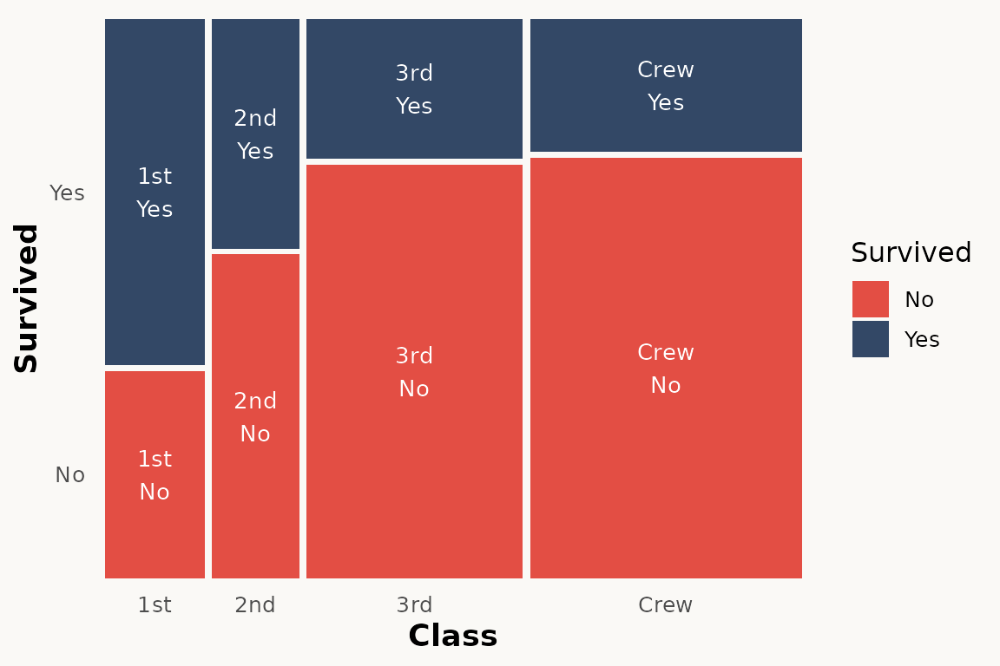

[`geom_marimekko_text()`](../reference/geom_marimekko_text.md) reads
tile positions from the preceding
[`geom_marimekko()`](../reference/geom_marimekko.md) layer — only the
`label` aesthetic is needed. Use
[`after_stat()`](https://ggplot2.tidyverse.org/reference/aes_eval.html)
for computed variables like `weight` (count), `.proportion`, or the
original variable columns.

### Axis labels and percentages

The paper uses `scale_x_productlist()` for axis labels:

``` r
# ggmosaic
ggplot(titanic) +
  geom_mosaic(aes(x = product(Class), fill = Survived, weight = Freq)) +
  scale_x_productlist()
```

``` r
# marimekko — with optional marginal percentages
ggplot(titanic) +
  geom_marimekko(aes(fill = Survived, weight = Freq),
    formula = ~ Class | Survived,
    show_percentages = TRUE
  ) +
  theme_marimekko()
```

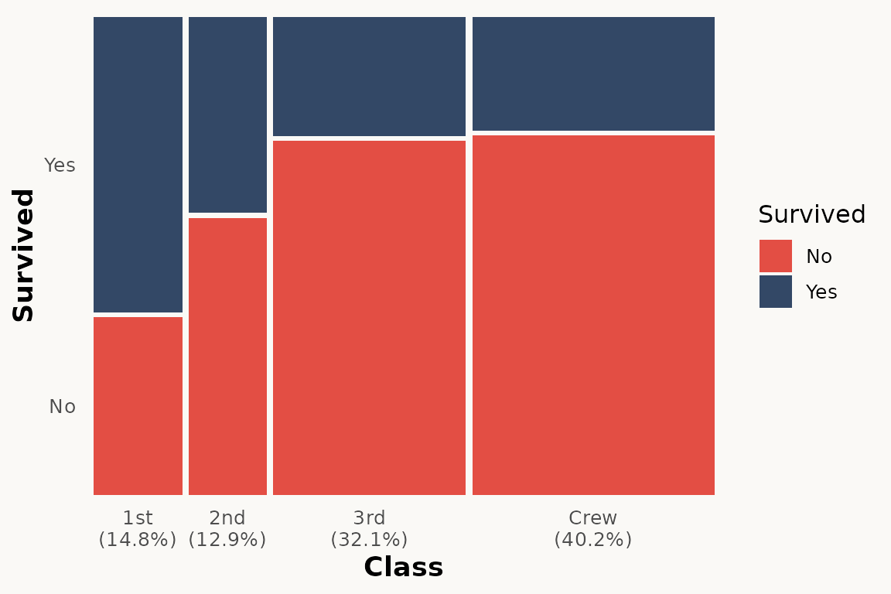

### HairEyeColor — a larger example

The paper uses multi-variable examples to show how mosaic plots reveal
associations. Here we use the built-in `HairEyeColor` dataset:

``` r
ggplot(hair) +
  geom_marimekko(aes(fill = Eye, weight = Freq),
    formula = ~ Hair | Eye,
    show_percentages = TRUE
  ) +
  theme_marimekko() +
  labs(title = "Hair color vs Eye color")
```

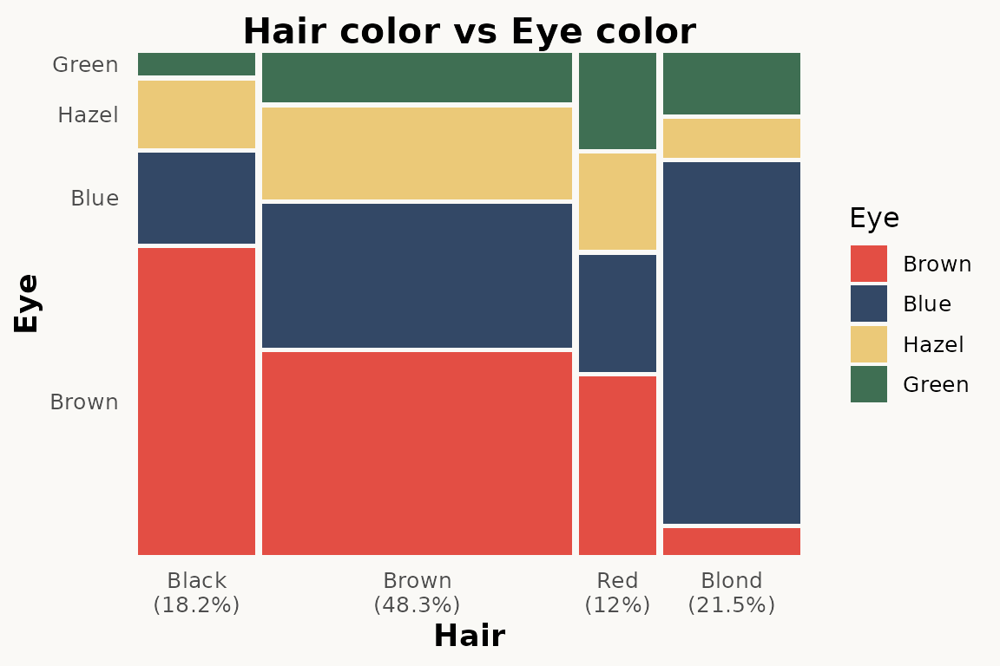

Three-variable version with Sex:

``` r
ggplot(hair) +
  geom_marimekko(aes(fill = Eye, weight = Freq),
    formula = ~ Hair | Sex | Eye
  ) +
  theme_marimekko() +
  labs(title = "Hair / Sex / Eye")
```

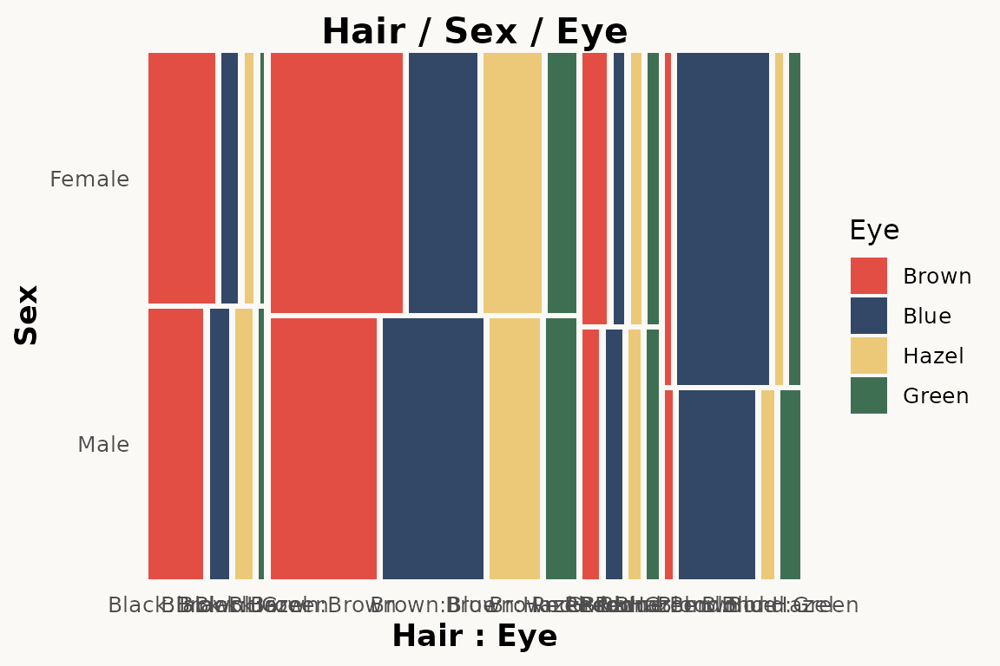

## Key differences to be aware of

### 1. No `product()` wrapper

ggmosaic required wrapping variables in `product()`. marimekko uses a
formula-based API:

- `formula = ~ a | b` — specifies variable hierarchy (`|` alternates
  direction, `+` groups)
- `fill` — tile colour (defaults to last formula variable)
- `weight` — observation weights / counts

### 2. Automatic axis labels

ggmosaic handled axis labels internally. marimekko also adds axis labels
automatically via [`geom_marimekko()`](../reference/geom_marimekko.md).
Use `show_percentages = TRUE` in
[`geom_marimekko()`](../reference/geom_marimekko.md) to append marginal
percentages to the x-axis labels.

### 3. No `divider` argument

ggmosaic used `divider = c("vspine", "hspine", ...)` to control
partitioning direction. marimekko encodes direction in the formula — `|`
alternates between horizontal and vertical, always starting horizontal.
Use
[`coord_flip()`](https://ggplot2.tidyverse.org/reference/coord_flip.html)
for vertical-first orientation.

### 4. `inherit.aes` defaults to `TRUE`

ggmosaic set `inherit.aes = FALSE` by default, requiring you to repeat
aesthetics in every layer. marimekko follows ggplot2 convention —
`inherit.aes = TRUE` — so aesthetics set in `ggplot(aes(...))` are
inherited.

### 5. Text labels need explicit `label` aesthetic

[`geom_marimekko_text()`](../reference/geom_marimekko_text.md) requires
`label = after_stat(weight)` or similar. ggmosaic’s `geom_mosaic_text()`
auto-generated labels.

## plotly support

marimekko plots work with
[`plotly::ggplotly()`](https://rdrr.io/pkg/plotly/man/ggplotly.html) out
of the box — simply pass your plot object and get an interactive
version:

``` r
library(plotly)

p <- ggplot(titanic) +
  geom_marimekko(aes(fill = Survived, weight = Freq),
    formula = ~ Class | Survived
  )

ggplotly(p)
```

This also works with
[`geom_marimekko_text()`](../reference/geom_marimekko_text.md),
[`geom_marimekko_label()`](../reference/geom_marimekko_label.md)

## Search-and-replace checklist

For a quick mechanical migration, apply these replacements:

    geom_mosaic(          →  geom_marimekko(
    geom_mosaic_text(     →  geom_marimekko_text(
    theme_mosaic(         →  theme_marimekko(
    library(ggmosaic)     →  library(marimekko)

Then manually:

1.  Remove all `product()` wrappers – add `formula = ~ Var1 | Var2`
    instead
2.  Remove `conds` aesthetic – use
    [`facet_wrap()`](https://ggplot2.tidyverse.org/reference/facet_wrap.html)
    or a multi-variable formula
3.  Remove `scale_x_productlist()` / `scale_y_productlist()` – axis
    labels are now automatic
4.  Remove `divider = ...` – direction is encoded in the formula
5.  Replace `offset = ...` with `gap` / `gap_x` / `gap_y`
6.  Add explicit `label = after_stat(weight)` to text layers
7.  Set `inherit.aes = FALSE` only where deliberately needed
8.  Move `show_percentages = TRUE` from scale to
    `geom_marimekko(..., show_percentages = TRUE)`

## References

Jeppson, H. and Hofmann, H. (2023). Generalized Mosaic Plots in the
ggplot2 Framework. *The R Journal*, 14(4), 50–73.
[doi:10.32614/RJ-2023-013](https://doi.org/10.32614/RJ-2023-013)
